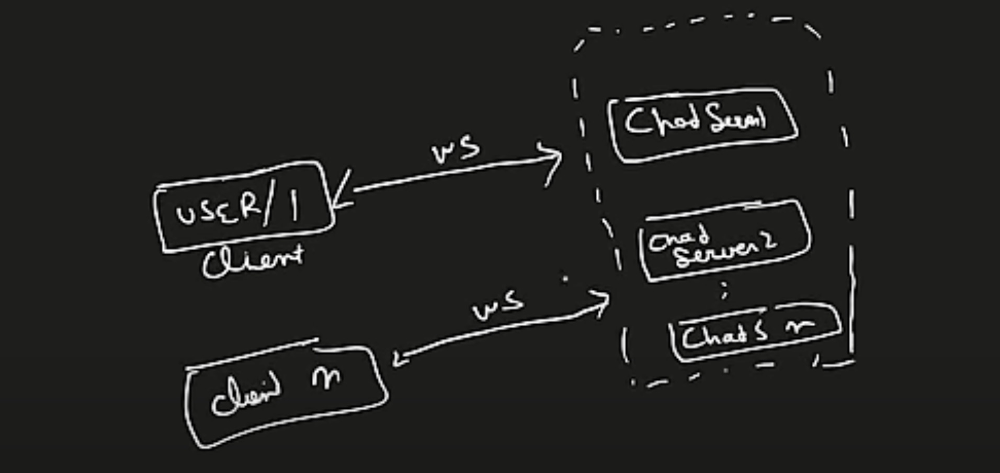
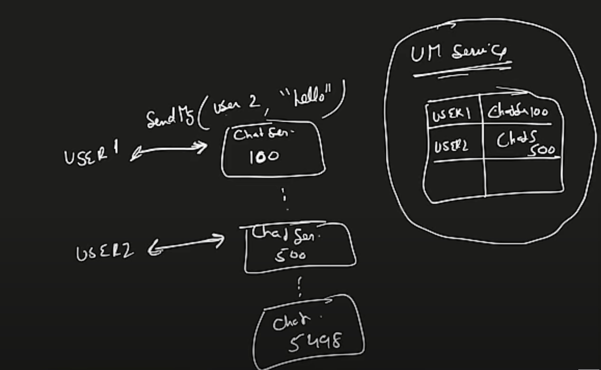
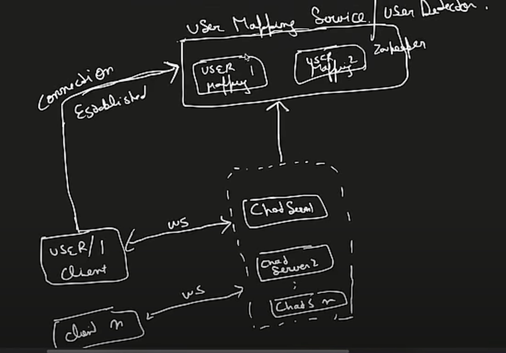

# WhatsApp System Design

## 1. Requirement Gathering

### a. Functional (MVP - Must Be There)

- 1:1 Send / Receive Message (Text)
- Image messages (can be considered after reliable text messaging)
- Group message support
- Last seen / Online - Offline
- Login / Authentication

### b. Non-Functional (Good to Have)

- Scalability → Huge traffic
- Low Latency
- Availability

---

## 2. Back of the Envelope

- **Total Users**: 2 Billion
- **DAU**: 50 Million
- **1 user → 10 messages → 4 people in a day**

**Total Messages per Day**  
`50 million * 40 = 2000 million ≈ 2 billion messages/day`

**Message Size**  
`1 msg = 100 characters = 100 bytes`  
`2 billion * 100 bytes = 200 GB/day`

If chat history is to be stored (e.g., like Telegram/Discord as whatsapp stores on the client's device):  
`200 GB * 365 * 10 = 730,000 GB (10 years)`

---

## 3. Design of Chat Application

Peer-to-Peer Communication when two systems know their IPs and talk directly

- Not scalable
- No support for grouping

### Server-Based Architecture

Users connect via **Chat Server**:

- Handles:
    - Scalability
    - Grouping
    - Chat History
    - Availability

### Messaging Flow
Chat server has to send the message to User B
``` 
User A —send_msg()—> ChatServer —receive()—> User B 
```


**HTTP is request-response**, so "receive" part can not be handled by the HTTP, as the communication should be 2 way

---

### So there are 3 ways

### 1. Polling

- Client repeatedly asks server if there’s a message, Server responds to it (No message) and then connection closed.\
Basically handshaking and TCP Connection
- Inefficient: unnecessary handshakes and TCP connections

### 2. Long Polling

- Client asks for message, server waits and holds the connection for a threshold time (e.g., 1 minute)
- Still has similar disadvantage

### 3. WebSocket

- Bi-directional, persistent connection
- Single open connection for both directions
- Ideal for chat systems
- It will do handshake

---

## 5. WebSocket Chat Architecture

### Architecture

```
User / Client → Chat Servers (Multiple)
```



**Message Flow**:
- User 1 → ChatServer100
- User 2 → ChatServer500



**User Mapping Service / User Detector Service**:
- Maintains info about user-to-chatserver mapping
- User management is taken care by User mapping Service
- User mapping service - **Zookeeper** : It provides the coordination in distributed environment

---

### Connection Establishment

- User is connected to chat server via web-socket and HTTP for services like login
- Whenever a user comes online, the connection is established, mapping service provides a chat server to the user

```
User 1 connects → Mapping service assigns ChatServer100
Entry: User1 → ChatServer100
```



---

## 6. Message Routing (Happy Flow)

- `sendMessage(from, to, msg, type)`  
  (type = Group / 1:1)

- ChatServer100 (User1) contacts Mapping Service to find chat server for User2
- Mapping returns ChatServer101
- Message delivered

---

## 7. Chat History

- Use a **DB** (NoSQL preferred)
- Connect Chat Servers to DB

#### Read Ops:
- Fetch chat history
- Group messages
- Profile info

#### Write Ops:
- Send message
- Update profile pic

### Why NoSQL?

- No complex joins are required in the data
- We have Billions of messages/day
- Fast search, low latency
- Horizontal sharding using consistent hashing

#### Data Format

- Fields: `msg_id`, `from`, `to`, `timestamp`\
  We can store data in multiple servers (consistent hashing), data is shareded horizontally where
  the Partition Key is "**From and To**"

Now for chat history, we need to have a sequence, msg id can be used for this
SQL supports auto-increment but NoSQL doesn’t have any such thing.

In a paritcular partition, ordering can  be done by msg_id
We can use timestamp to generate the msg_id or
the msg_id will be local to any node which means that 2 different nodes can have same id because sequencing is different here


---

## 8. Offline Use Case

- User1 → ChatServer1
- User2 → ChatServer2 (down)

The ChatServer1 will not find any active chatserver for user2 from zookeeper
So it will just put the data in DB

So now let’s build the Login system

Login system also talks with User mapping

```
User 2 —> Login —> User Mapping Service
```

- Login service can be HTTP

User mapping service will provide a ‘chatserver3’
This chatserver3 will check the DB, if there are any unread msg in DB for user2

It will send those msgs to user2

```
ChatServer1 → Mapping → No active server for User2  
→ Message stored in DB

User2 logs in → Login → Mapping → Assigned ChatServer3  
→ ChatServer3 checks DB → Sends unread messages
```

---

## 9. Group Messaging

**Schema**:  
`GroupID, msg_id, user, msg, timestamp`
- Partition key: GroupID
- msg_id will fulfill the same purpose of storing the data in sequence in DB partition

For management purposes like User management, Group management,
The respective services will have their own dedicated DB ( SQL / No SQL ) for CRUD operations

```
User 1 —> ChatServer1 —> sends a message to Group
```
The chatserver1 will ask for the respective chatservers of all the members of the group


**Flow**:
- User1 → ChatServer1 → Sends Group message
- ChatServer1 → GroupService → Get members
- ChatServer1 → Mapping → Get chat servers of all members → Deliver

---

## 10. Last Seen / Presence System

There is a system called Presence system,

Client sends a heartbeat to the presence system periodically and the presence system records this

If for a particular threshold , there’s no heartbeat received from the user, the status of the user will be changed to **offline**

**Presence System**:
- Clients send periodic heartbeat
- Status updated based on threshold (e.g., 1 min)


Que : Why zookeeper can’t be checked if a chat server is allowed to a particular user or not?

Consider if for some reason ( network fluctuation ) the user is getting online - offline continuously, 
for every 1 or 2 seconds this continuous online, offline will be a very bad user experience.\
That’s why the presence system has a threshold(say 1 minute),  after then only the user will be considered as offline

---

