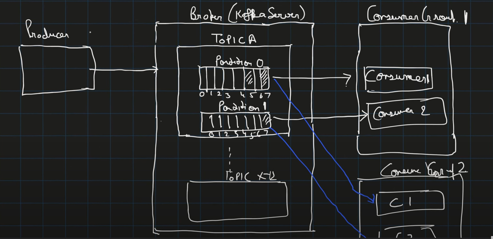
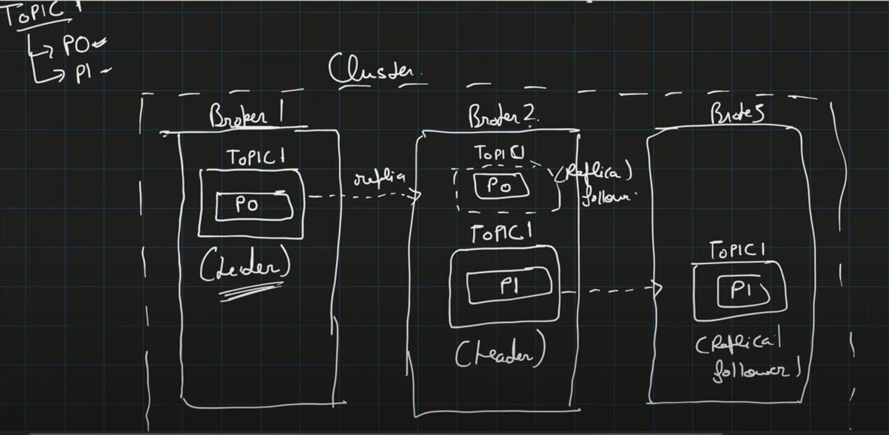
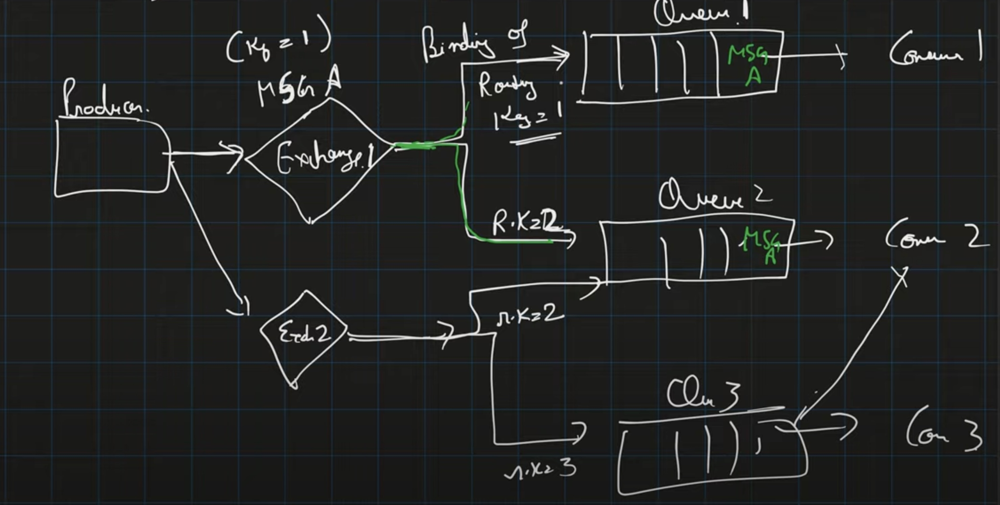

# Distributed Messaging Queue | Design Messaging Queue like RabbitMQ and Kafka

## What is MQ & Why We Need It

Message Queue (MQ) is used for asynchronous communication between producers and consumers.

### Advantages:
- **Asynchronous nature**
    - E.g., E-commerce: When a user places an order, a "send notification" message is pushed to a queue, and the notification service consumes it later.
- **Retry capability**: If the notification service is down, the message can be retried.
- **Pace matching**: Services pushing messages at different rates are decoupled from consumer processing speeds 
(Producer can produce at their own rate and consumers can consume with their own pace)

### Real-world Examples:
- **Cab/GPS Service**: Devices send location every 10 seconds → Queue buffers the data → Consumer processes at its own pace.

---

## Messaging Models

### 1. Point-to-Point
- Publisher sends messages to a queue.
- Only **one** consumer consumes a message (even if multiple are subscribed).

### 2. Publish-Subscribe (Pub/Sub)
- Publisher sends messages to an **exchange**.
- Exchange distributes messages to **multiple queues** based on binding logic (fanout, direct, topic).

---

## Kafka Architecture

### Core Components:
- **Producer**: Sends message to a topic.
- **Consumer**: Reads messages from partitions.
- **Consumer Group**: Each consumer in the group reads from different partitions.
- **Topic**: Logical collection of partitions.
- **Partition**: Actual data store within a topic.
- **Offset**: Position marker for messages.
- **Broker**: Kafka server handling topic and partition data.
- **Cluster**: Group of brokers.
- **Zookeeper**: Maintains metadata, leader election, and broker coordination.

### Flow:

```
Producer --> Broker --> Consumer Group
               |
                --> Topic (Partition)
```

Broker has topic\
Topic has Partitions\
Inside the partition, there is offset\
Consumer reads from the partition\
Each Consumer is part of 1 consumer group :

- Within a consumer group, different partition is accessed by different consumers,
```
For e.g.
Consumer Group 1 has Consumer 1 and 2
Partition 1 —> Consumer 1
Partition 2 —> Consumer 2
```
- But Partition 1 cannot be read by Consumer 2 at the same time when consumer 1 reads from Partition 1

- But a Partition can be read by consumer of different consumer group\
Consumer Group 2 has Consumer 3 and 4

- Partition 0 can be read by Consumer 3 also (when it is already read by Consumer 1)

**Cluster** :

Producer connects to Multiple Brokers (Kafka servers) may be running on different machines (nodes).\
These all brokers on different nodes together form a cluster




Now we have zookeeper,
It helps them to interact with each other, all the brokers talk with zooekeeper which gives info of every partition and consumer to one another

### Design a Message Queue

Message has - 
- Key
- Value (Mandatory)
- Partition 
- Topic (Mandatory)

```
Producer --> Message --> Topic A (3 Partitions)
```


#### Partitioning Logic:
- Message → Has `key`, `topic`, and optional `partition`.
    - If **key exists** → Hash of key decides partition that it needs to get published to.
    - If **no key, partition info exists** → Send to specific partition.
    - If **neither exists** → Use round robin.

#### Offset Management:
- Offset = position in partition.\
Consumers are reading from the partition, offset tells that till where the consumer has last read the message.
- On failure, another consumer in the same group resumes from last committed offset.

### Cluster & Replication:
Cluster is group of brokers

Assume we have 3 brokers
Topic 1 has 2 Partitions P0 and P1



We have replicas of topic --> Partition

Let's consider Topic 1 - P0 has replica in Broker 2\
Same goes for Topic 1 - P1 in Broker 3

- Those who are not the replicas are known as the **Leaders** and\
the replicas are known as the **Followers**
- All reads and writes happen through leader
- When leader goes down, replicas ( followers) take over.
- Followers keep on syncing with leaders, whenever any new message comes in,\
the replicas read from leaders and updates themselves.

### Failure Handling:
When Consumer not able to process the message,
- Retry a message N times.
- After threshold, move to **Dead Letter Queue (DLQ)**.

> Kafka is **Pull-based**: Consumers pull messages from partitions.

---

## RabbitMQ Architecture

> RabbitMQ is **Push-based** approach

### Core Components:
- **Producer**
- **Exchange**
- **Queue**
- **Consumer**

### Routing:
- Producer sends to **Exchange**.
- Exchange routes to **Queue** based on **routing key**.

### Exchange Types:
1. **Fanout**: Broadcasts message to all queues, that are related to a particular exchange.
2. **Direct**: Routes based on exact routing key match (it should be exactly matching - message key and routing key).



3. **Topic**: Wildcard matching (e.g., `India.*`, `*.123`). A wild card is used.\
Example : Binding key like _***123**_.\
Message comes as **_India_213_**,\
it will match this wild card of the exchange and will be sent to particular queue associated.

### No Offsets:
- Supports requeuing.
- Failed messages → DLQ after retries.

---
