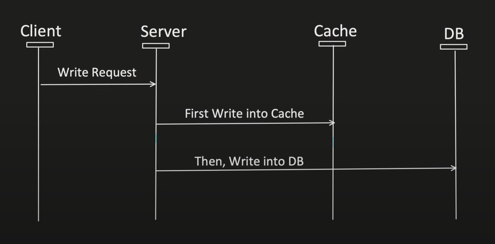

# Distributed Caching and Caching Strategies

---

## What is Caching?

- Caching is the process of storing frequently accessed data in fast-access memory.
- It helps reduce latency and improves system performance.
- It contributes to fault tolerance and reduces the load on backend systems.

### Layers of Caching

- **Client-side**: Browser caching
- **CDN**: Stores static data
- **Load Balancer**
- **Server-side Application Caching** (e.g., Redis)


```
Client → Load Balancer → App Server → Cache (Redis) → Database
```

- App server checks cache first.
- If data not in cache (cache miss), fetch from DB, update cache.

---

## What is Distributed Caching?

### Why Do We Need It?

1. **Scalability**: Single cache instance can’t handle large traffic.
2. **Avoid Single Point of Failure**: Distributes load across multiple cache servers.

### How It Works

- Multiple cache servers form a **cache pool**.
- Each application server has a **cache client**.
- Cache client uses **consistent hashing** to select the appropriate cache node.
- Ensures even distribution and high availability.


---

## Caching Strategy

### 1. Cache Aside

- Application first checks the cache.
- If data found in Cache, it's called Cache hit and data is returned to client.
- If data is not found in cache, it’s called cache miss; application fetches the data from DB, stores it back to the Cache, and data is returned to the client.

**Pros:**
1. Good approach for heavy read applications.
2. Even if cache is down, request will not fail, as it will fetch the data from DB.
3. Cache document data structure can be different than the data present in DB.

**Cons:**
1. For new data read, there will always be cache-miss first (to resolve this, generally we can pre-heat the cache).
2. If appropriate caching is not used during write operations, there is a chance of inconsistency between Cache and DB.


---

### 2. Read Through Cache

- Application first checks the cache.
- If data found in Cache, it's called Cache hit and data is returned to client.
- If data is not found in cache, it’s called cache miss; cache library itself fetches the data from the DB, stores it back to Cache, and data is returned to the application.

**Pros:**
- Good approach for heavy read applications.
- Logic of fetching the data from DB and updating Cache is separated from the application.

**Cons:**
1. For new data read, there will always be cache-miss first (to resolve this, generally we can pre-heat the cache).
2. If appropriate caching is not used during write operations, there is a chance of inconsistency between Cache and DB.
3. Cache document structure should be same as DB.


---

### 3. Write Around Cache

- Directly writes data into DB.
- It does not update the Cache (it will make cache invalidate).

Anytime whenever there is a write operation, the cache is marked as dirty or invalidated, and then whenever the get is called 
it will read from the DB and will update the cache with latest data.


**Pros:**
- Good approach for heavy read applications.
- It has to be used with Read Through or Cache Aside cache. Alone this cache strategy is of no use.
- Resolves inconsistency problem between Cache and DB.

**Cons:**
1. For new data read, there will always be cache-miss first (to resolve this, generally we can pre-heat the cache).
2. If DB is down, write operation will fail.


---

### 4. Write Through Cache

- First write data into the Cache.
- Then synchronously write data into the DB.

If any of the insertions fails, throw the exception, so both should pass. In case of failure of any one of them, rollback 
everything (that’s why it is "synchronous").

**Pros:**
- Cache and DB always remain consistent.
- Cache hit chance increases a lot.

**Cons:**
- Alone it’s not useful; it will increase the latency (that’s why it is always used with Read Through or Cache Aside cache).
- 2 Phase commit needs to be supported with this to maintain the transactional property.
- If DB is down, write operation will fail (not fully fault tolerant).



---

### 5. Write Back (or Behind) Cache

- First writes data into Cache.
- Then asynchronously writes data into the DB.

First write data into cache and then push the message to the queue; then from queue DB writes take place.

**Pros:**
- Good for write-heavy applications.
- Improves the write operation latency as writing into the DB happens asynchronously.
- Cache hit chance increases a lot.
- Gives much better performance when used with the Read Through Cache or Cache Aside.
- Even when DB fails, write operation will still work.

**Cons:**
- If data is removed from Cache and DB write still not happens, then there is a chance of an issue.
    - (It is handled by keeping the TAT of cache little higher like 2 days.)


---


## Summary Table

| Strategy        | Read Flow            | Write Flow                  | Best For           | Cache Consistency | DB Dependency |
|----------------|----------------------|-----------------------------|--------------------|-------------------|---------------|
| Cache-Aside    | App → Cache → DB     | App → DB (+ invalidate)     | Read-heavy         | Medium             | Optional      |
| Read-Through   | Cache handles DB     | App → DB (manual invalidate)| Read-heavy         | Medium             | Optional      |
| Write-Around   | App → Cache → DB     | App → DB (cache invalidate) | Read-heavy         | Medium             | Mandatory     |
| Write-Through  | App → Cache + DB     | App → Cache + DB (sync)     | Read + write mixed | High               | Mandatory     |
| Write-Back     | App → Cache → Queue  | Cache → DB (async)          | Write-heavy        | Low (eventual)     | Optional      |

---

## Cache Eviction Policies

- **LRU** (Least Recently Used)
- **FIFO** (First In First Out)
- **LFU** (Least Frequently Used)
