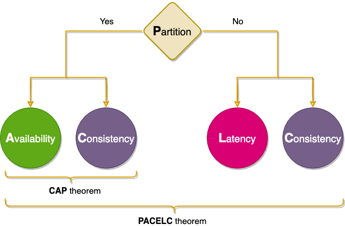

# CAP Theorem

---

## What is the CAP Theorem?

The **CAP Theorem** (also called Brewer's Theorem) is a core principle in **distributed system design**. It states that **a distributed system can only provide two out of the following three guarantees at the same time**:

1. **Consistency (C)**
2. **Availability (A)**
3. **Partition Tolerance (P)**

> It is **impossible** to achieve all three guarantees simultaneously in a distributed environment.

---

##  Definitions

### 1. **Consistency (C)**
- Every read receives the **most recent write** or an error.
- All nodes return the same data at any given time.
- Analogous to ACID consistency in databases.

### 2. **Availability (A)**
- Every request receives a **non-error response**, regardless of the node state.
- The system continues to operate even if some nodes are down.

### 3. **Partition Tolerance (P)**
- The system continues to function even if **network communication between nodes is lost**.
- Must handle **message loss** or **delayed communication** between parts of the system.

---

##  Trade-offs in Real-World Systems

During a **network partition**, a system designer must choose between:

- **Consistency vs. Availability**

| Chosen Pair     | Description                                                                 | Examples                            |
|------------------|-----------------------------------------------------------------------------|-------------------------------------|
| **CP** (Consistent + Partition-tolerant) | System sacrifices availability to ensure consistency during partitions. | HBase, MongoDB (with strong consistency settings), traditional RDBMS in distributed setup |
| **AP** (Available + Partition-tolerant) | System remains available, but may return stale or inconsistent data.    | CouchDB, Cassandra, DynamoDB       |
| **CA** (Consistent + Available)         | Only works in environments **without partitions** – not realistic in distributed systems. | Single-node databases              |

---

##  Use in High-Level Design (HLD)

In HLD interviews or system architecture planning:

- **Understand trade-offs** between consistency and availability depending on use case.
- **Design decision** examples:
    - A **banking system** requires **CP**: must show correct balances.
    - A **social media feed** can tolerate **AP**: better to show stale data than show errors.
- Apply the theorem when designing:
    - **Microservices**
    - **Databases**
    - **APIs**
    - **Caching layers**

---

##  Summary

- CAP Theorem applies to **any distributed system**.
- Network partitions are a **reality**, so designers must choose **between Consistency and Availability**.
- Helps architects define **failure-handling** strategies.

>  Always ask: *What does the system need more — consistency or availability — when a failure occurs?*

---

##  Mnemonic

**C**an’t **A**ll **P**lay together  
Only two out of three can be chosen!

__________________________________________________________________________________________________________________

## Extras 

PACELC theorem to the rescue
The PACELC theorem states that in a system that replicates data:

if there is a partition ('P'), a distributed system can tradeoff between availability and consistency (i.e., 'A' and 'C');
else ('E'), when the system is running normally in the absence of partitions, the system can tradeoff between latency ('L') and consistency ('C').
PACELC Theorem
PACELC Theorem
The first part of the theorem (PAC) is the same as the CAP theorem, and the ELC is the extension. The whole thesis is assuming we maintain high availability by replication. So, when there is a failure, CAP theorem prevails. But if not, we still have to consider the tradeoff between consistency and latency of a replicated system.

Examples
Dynamo and Cassandra are PA/EL systems: They choose availability over consistency when a partition occurs; otherwise, they choose lower latency.
BigTable and HBase are PC/EC systems: They will always choose consistency, giving up availability and lower latency.
MongoDB can be considered PA/EC (default configuration): MongoDB works in a primary/secondaries configuration. In the default configuration, all writes and reads are performed on the primary. As all replication is done asynchronously (from primary to secondaries), when there is a network partition in which primary is lost or becomes isolated on the minority side, there is a chance of losing data that is unreplicated to secondaries, hence there is a loss of consistency during partitions. Therefore it can be concluded that in the case of a network partition, MongoDB chooses availability, but otherwise guarantees consistency. Alternately, when MongoDB is configured to write on majority replicas and read from the primary, it could be categorized as PC/EC.