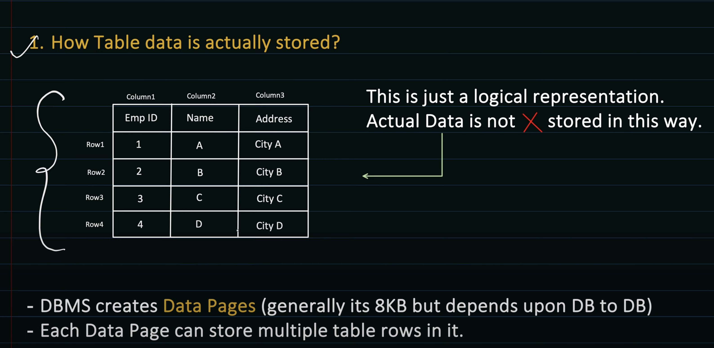
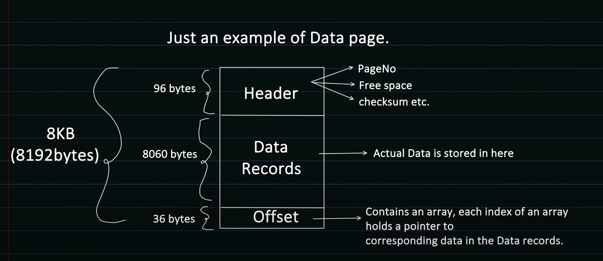
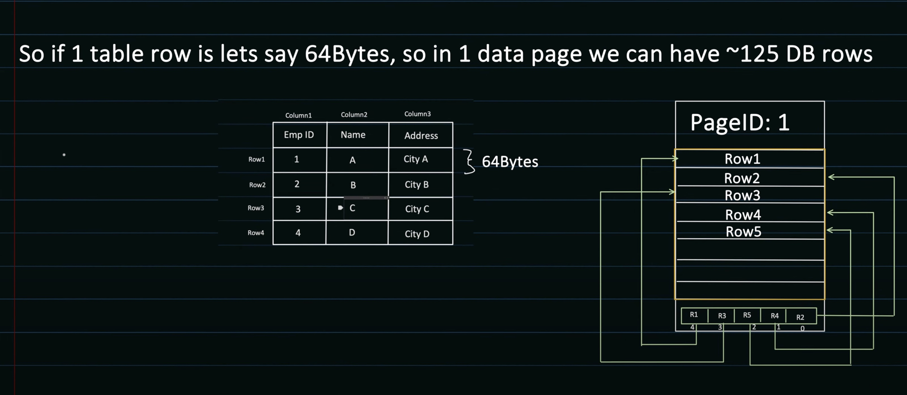
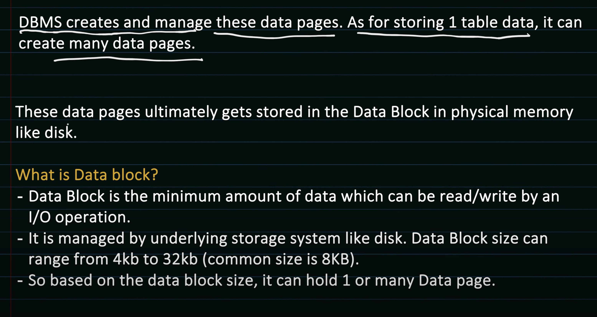
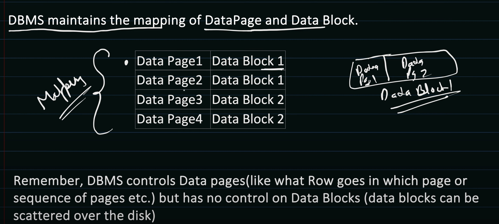
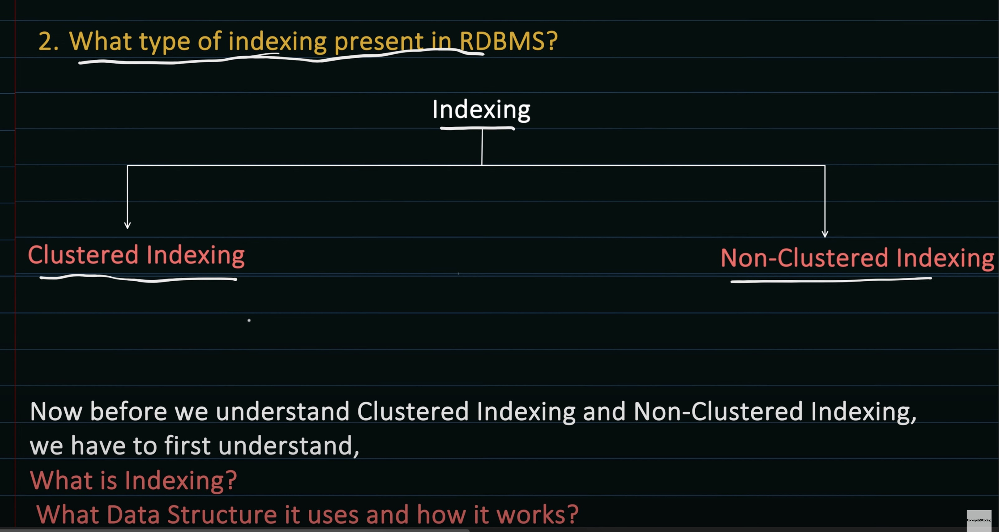
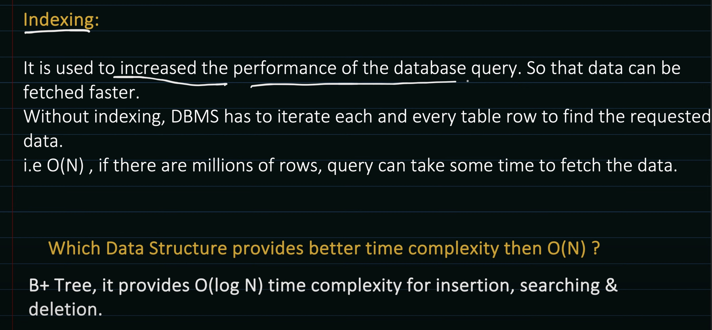
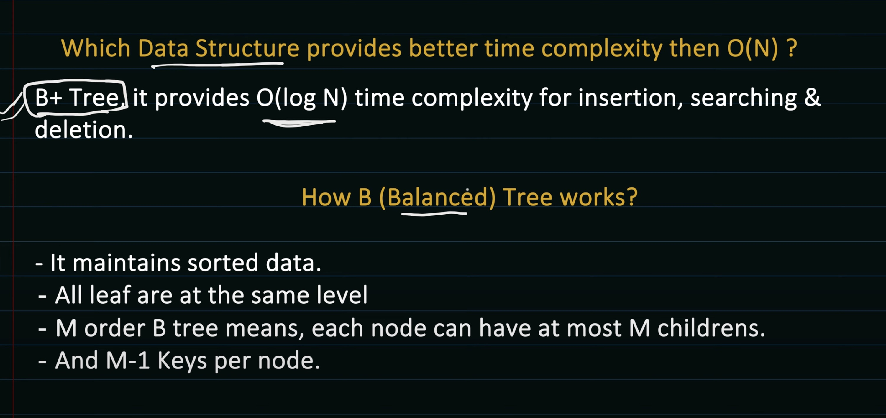

// TODO

# Databse Indexing

Few things we have to understand first, before we see how indexing works.

1. How Table data (rows) are actually stored?
2. What type of indexing present?
3. Understanding the data structure used for indexing and how it works?

Then we will combine all and see how actually the DBMS do the indexing.




Offset array points to the corresponding rows stored in the data records.
```
e.g. 
offset[0] -> row 1
offset[1] -> row 2
```





- DBMS has only control on the data pages, as how the data of tables are being stored in data records / data pages.\
The data block is being handled by disk (SDD / HDD)
- Data Page of DBMS (8KB), Data Block ranges from 4Kb to 32 KB (mostly it is of 8KB)










 < _Insert the explaination of B Tree here_ >


