# Distributed Concurrency Control

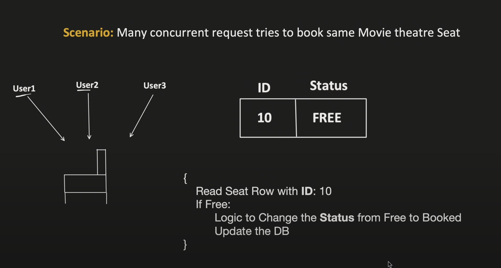

Critical Section : A piece of logic in the code base where we are trying to access the shared resource

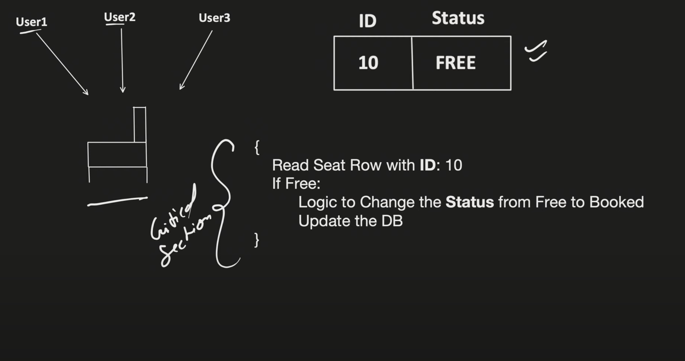

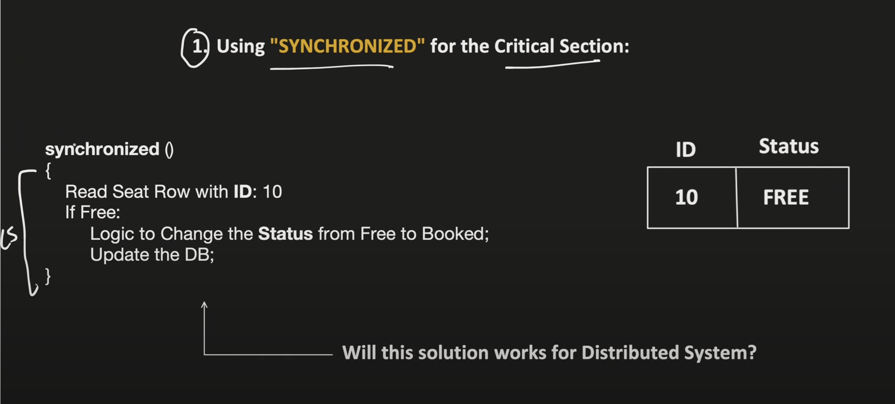

Using synchronized keyword, only single request will go

But this won't work for Distributed System,
When there is 1 process and multiple threads, synchronized keyword can work,
But in distributed system, the requests can be distributed to multiple servers in parallel


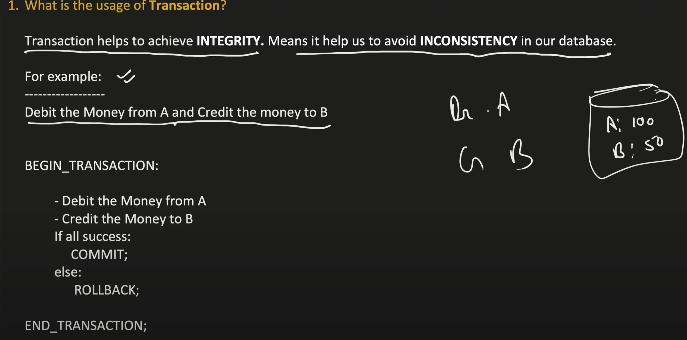

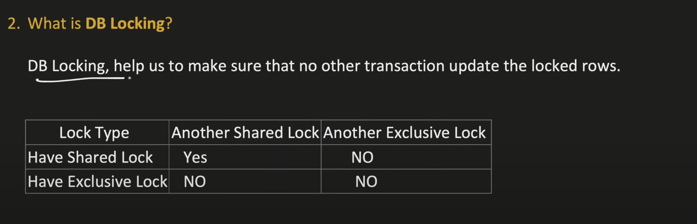

- Exclusive lock is denoted E : (X)
- Shared Lock is denoted by S : (S)

Shared Lock is generally known as Read Lock.\
When a transaction T1 has put a lock on any row, another transaction T2 can read it but no write can be done.\
Any other transaction can put a shared lock on the existing one.

Exclusive lock is neither read nor write lock, no other transaction can even read the row.

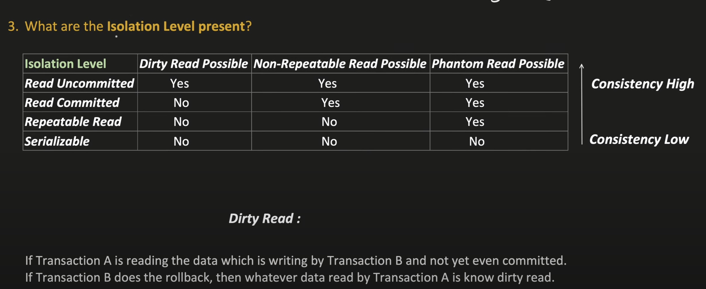

Another transaction reads some data which is being updated by some transaction but not yet committed.

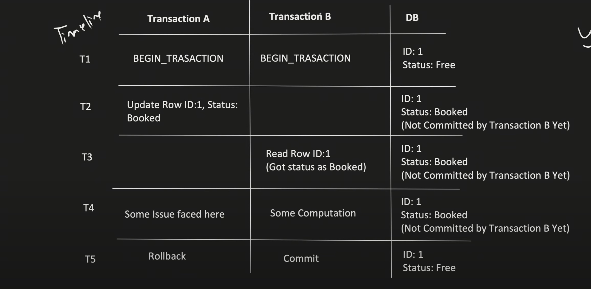


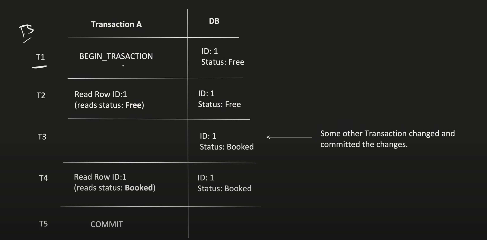


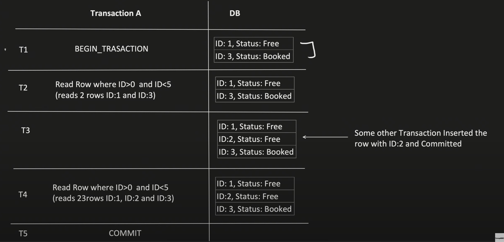

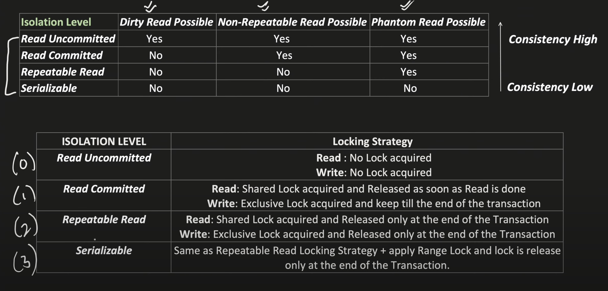
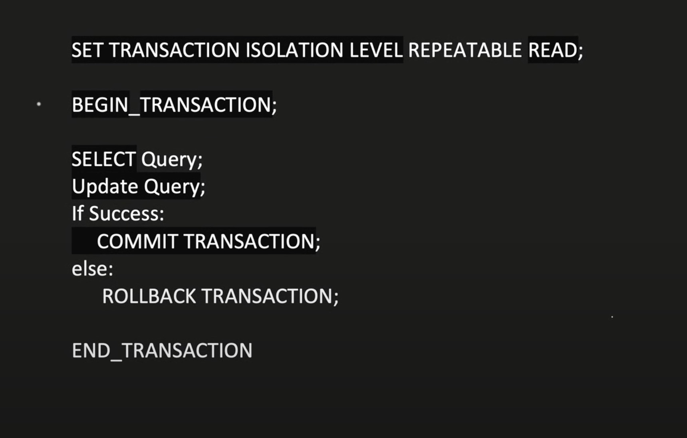

### Optimisitic Concurrency Control 
Allows Read Uncommited and Read Committed

### Pessimistic Concurrency Control
Allows Repeatable Read and Serializable


### Optimistic
Optimistic Concurrency Control uses a 'version', whenever any update operation takes place, Update the version value
DBs like mysql has version already, but for oracle we need to explicitly add a version column

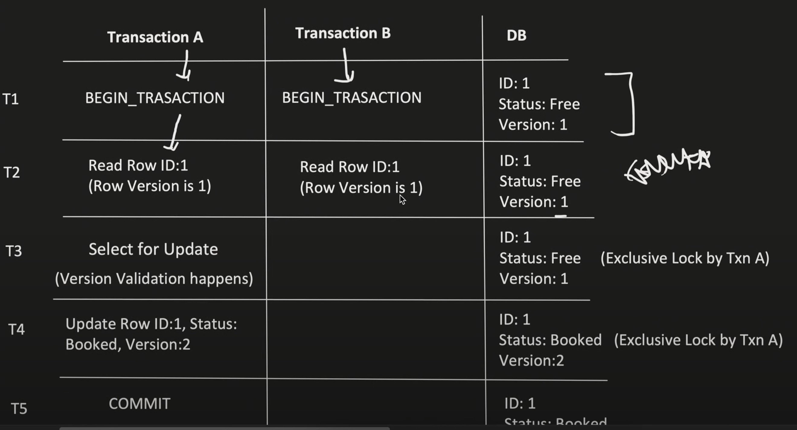
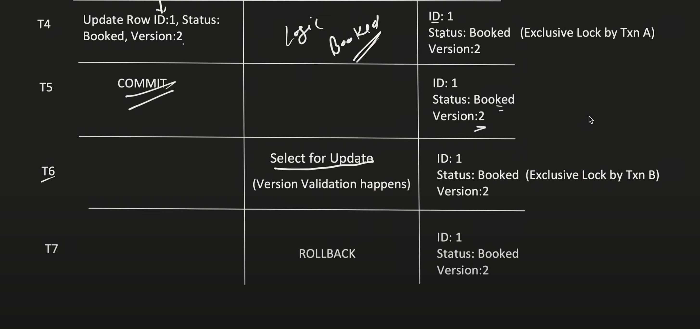
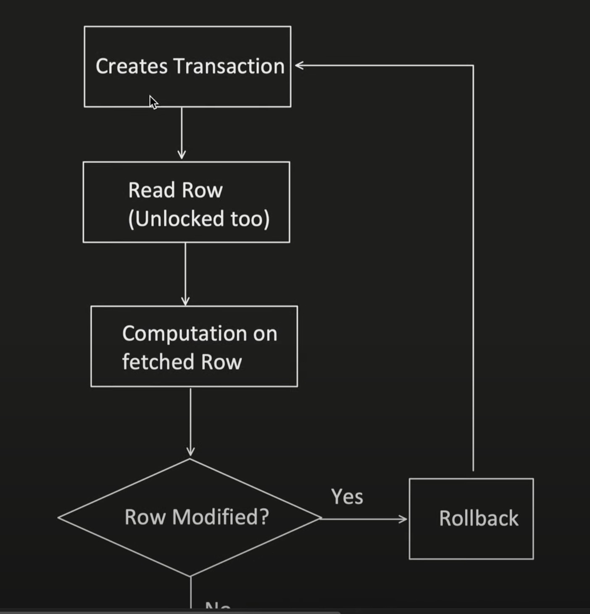
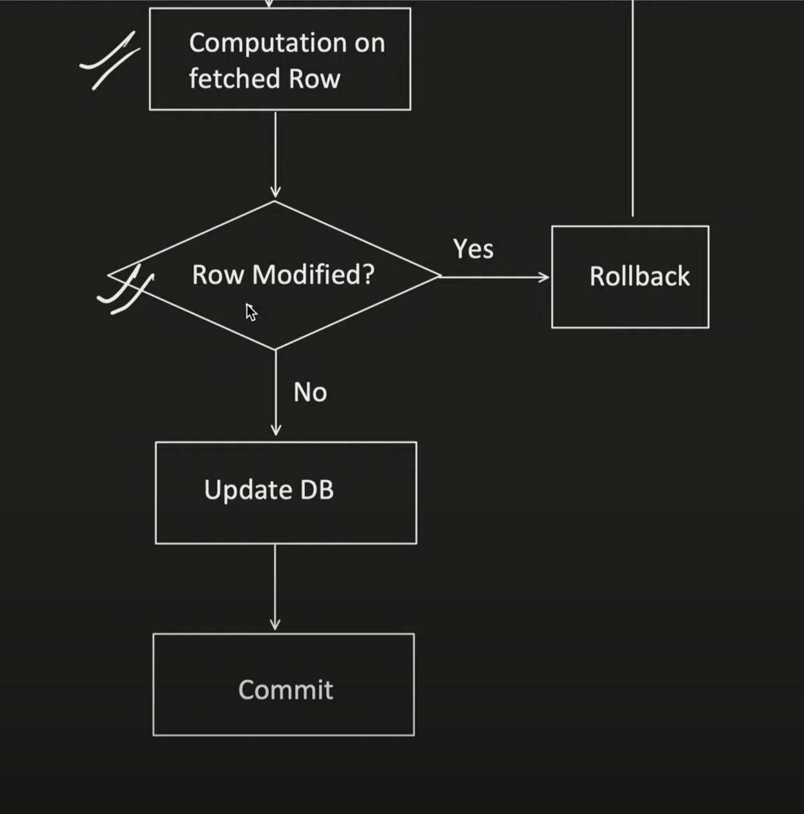

### Pessimistic

Deadlock may arise
```
e.g. 
T1          |           T2
Read A      |          Read B           --> at time stamp 1 
Write B     |          Wrtie A          --> at time stamp 2
```

Now write B is not possible because of the shared lock on B by T2
Same happens with Write A
Eventually they need to abort whole 

With Optimistic, there is on problem of deadlock, as soon as the Read is completed the lock is released.


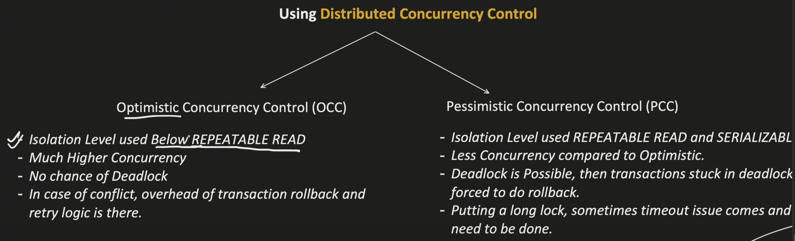

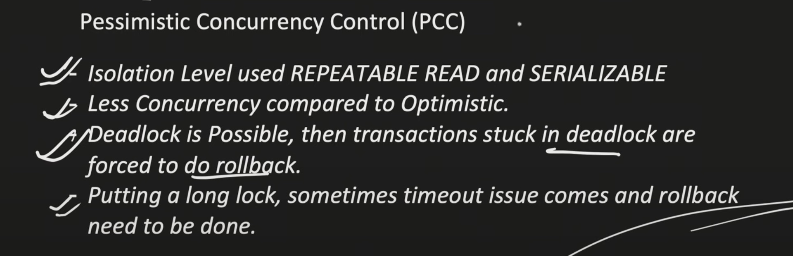