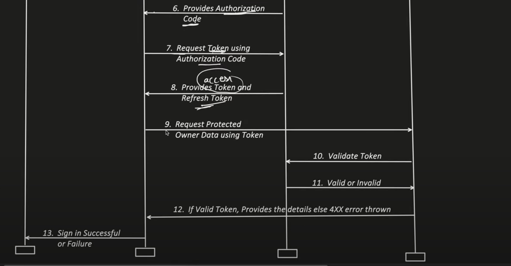

# OAuth 2.0

We have "**Sign in with Gmail**", "**Sign with Facebook**" option for authorization to any 3rd party website.

**Resouerce Owner** : User
**Client** : Who initiated the request (3rd Party website which is requesting to authorize using gmail / facebook )
**Authorization Server** : Gmail's Authorization Server (Gmail may have 2 components, so this is that component of 
Gmail which will take care of authorization)
**Resource Hosting Server** : User's resource are present to this server (Gmail itself will be the resource hosting server)

## Authorization Code Grant

 
Note : Please follow the official documentation for exact API names and more details about request and response

 

## Implicit Grant

## Resource Owner Password Credentials Grant

> **Correction
The Request type is **POST**

- There is no separate Authorization Call in ROPC Grant and
- Username and Password is not required using refresh token usage.

## Client Credential Grant

Used in cases when the client and Resource Owner is same

- There is no refresh token required.
- There is no Authorization call too.

## Refresh Token Grant