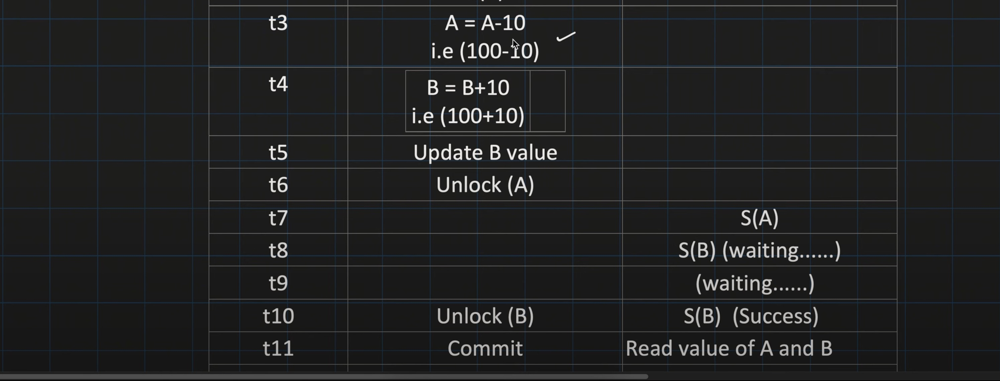

# Two Phase Locking

## Types of 2 Phase locking

1. Basic
2. Conservative
3. Strict / Rigorous

### 1. Basic

t1, t2 will be '**growing phase**'
t4, t5 will be '**shrinking phase**' 

Always, acquiring of locks happens first and then unlocking
Also even if no unlocking happens, 'commit' will automatically release all the locks.

Scheduler creates this graph

#### 2. Cascading Aborts (Issues of Basic 2PL)

