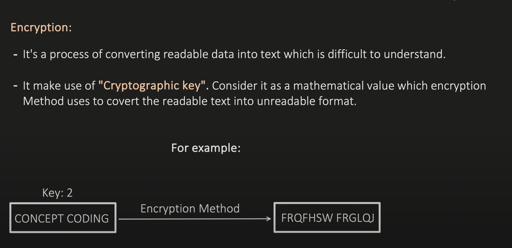
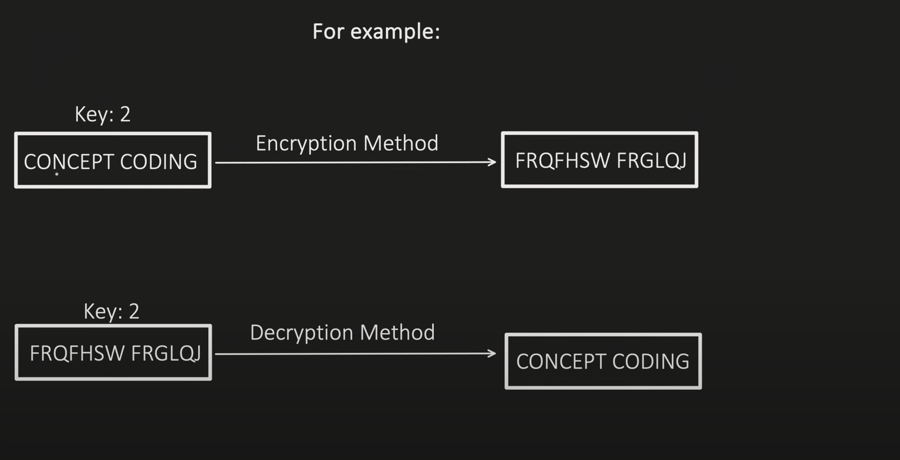
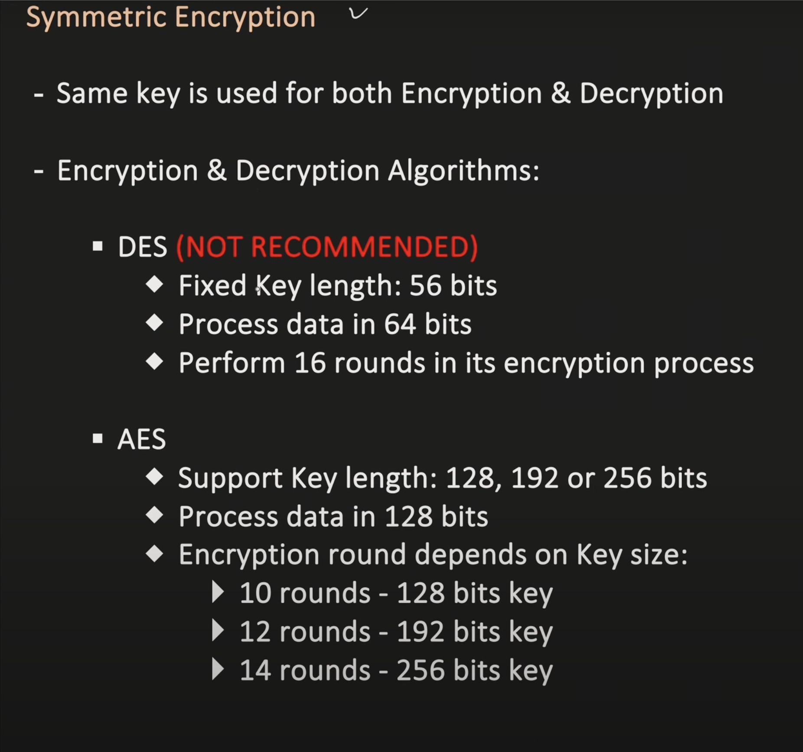
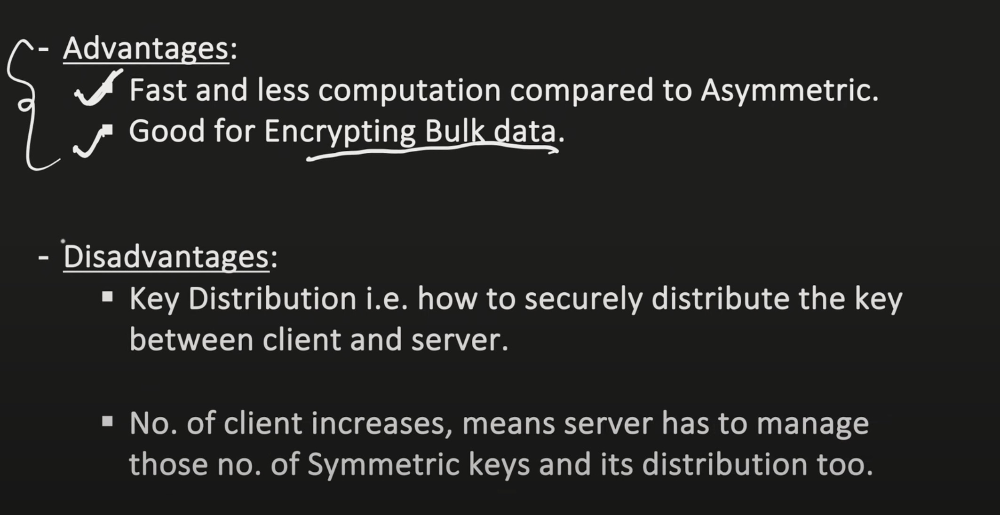
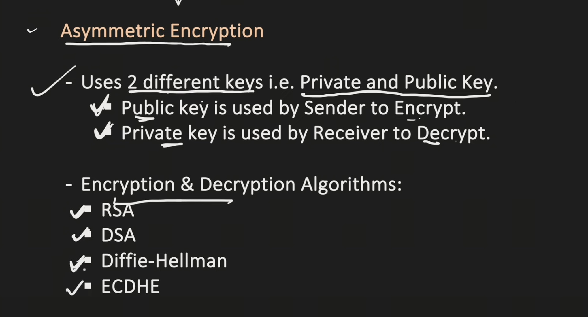
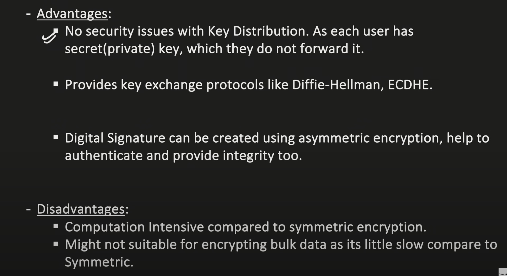
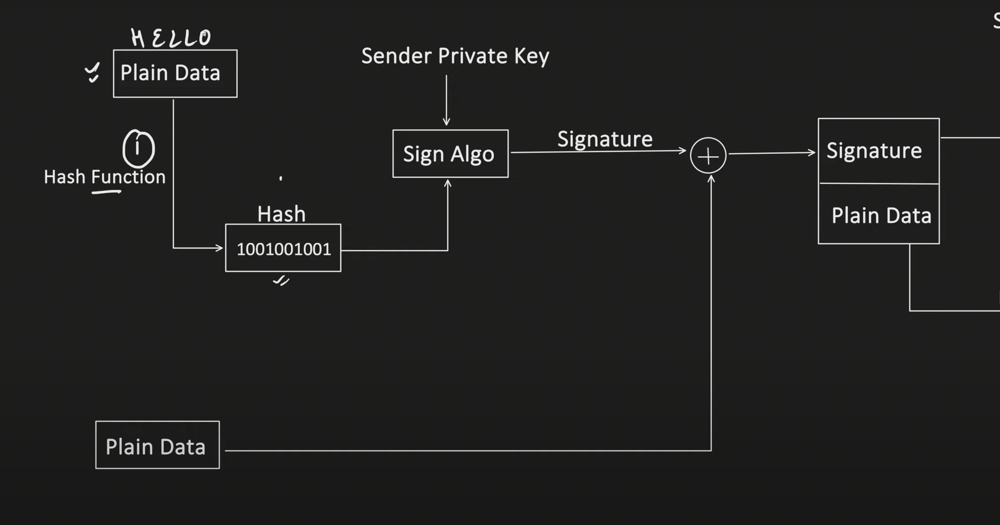
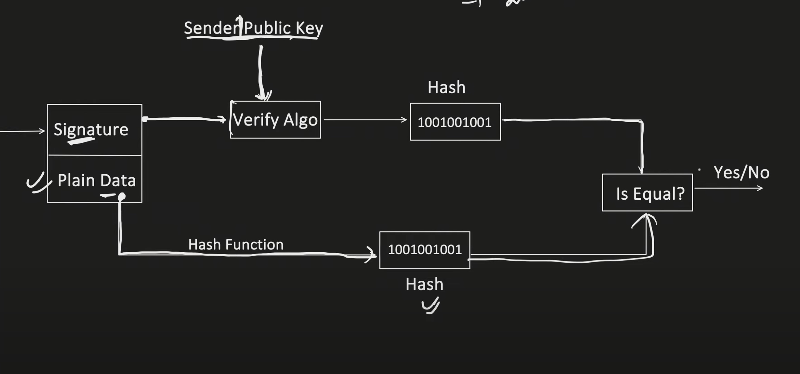

# Encryption

## Types
1. Symmetric
2. Assymmetric

> AES (Symmetric Encryption) : Its a block cipher, it process the data in block (of 128 bits)

> Diffie Hellman : It provides a way to share the secret key between Sender and Receiver over an insecure network.

## Digital Signature

