# JSON Web Token

Authentication Server : Any 3rd party libraries that will generate and authenticate the token

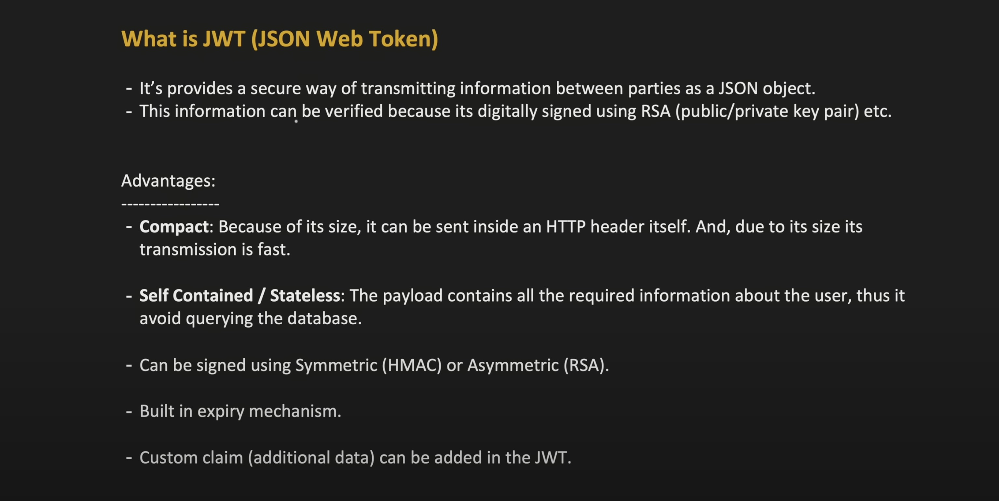
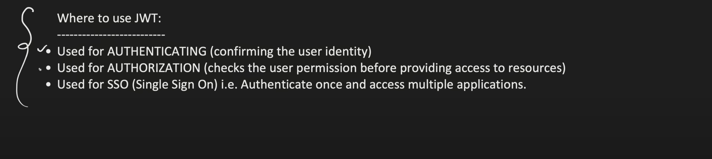
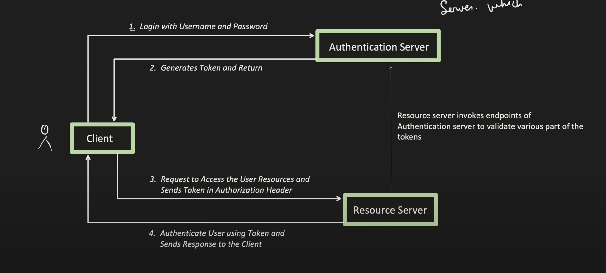

Before we understand more about JWT, lets first understand, what was popular before JWT and what are the problems with it?

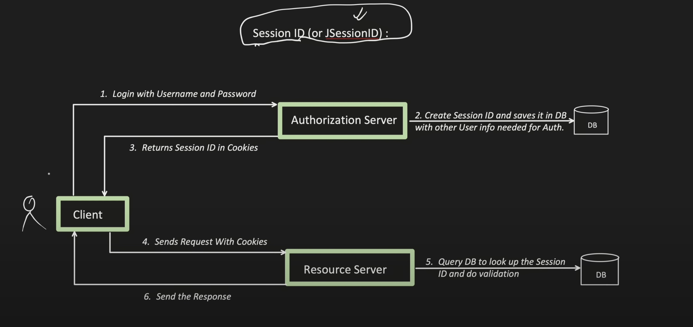
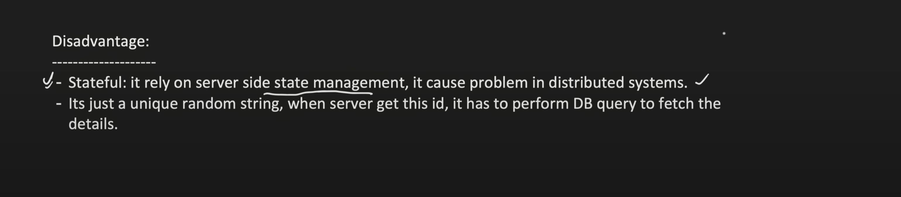
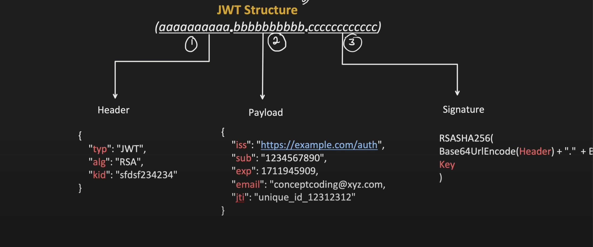
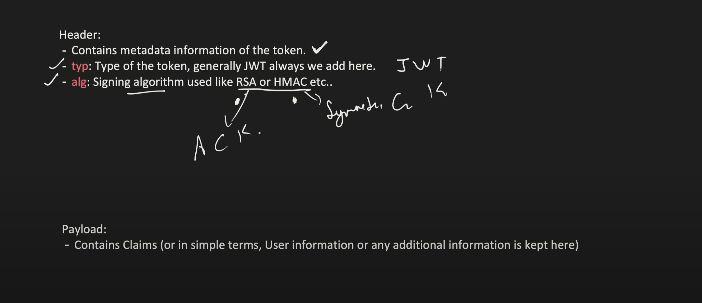
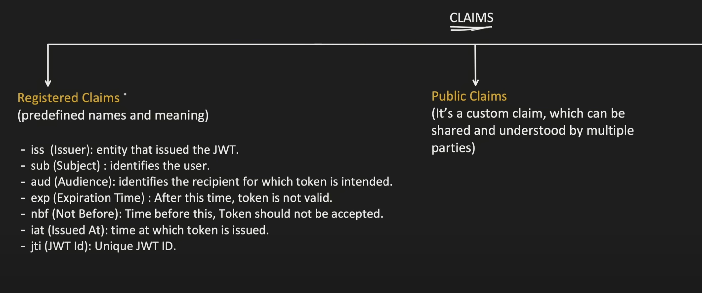
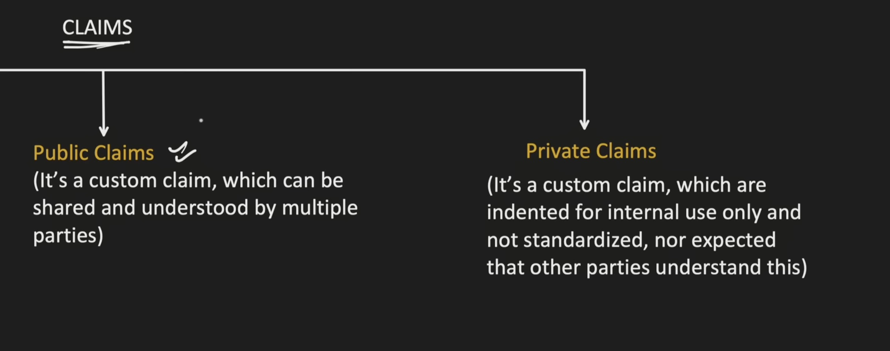
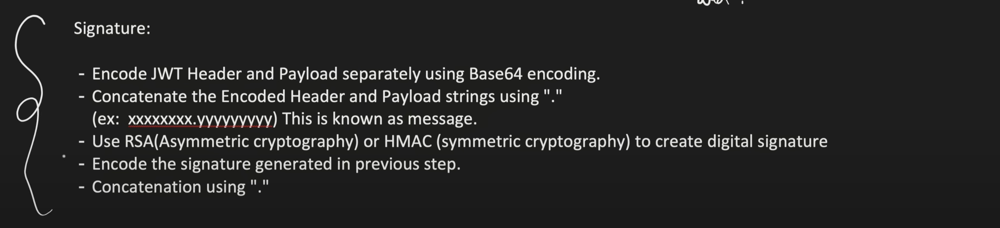
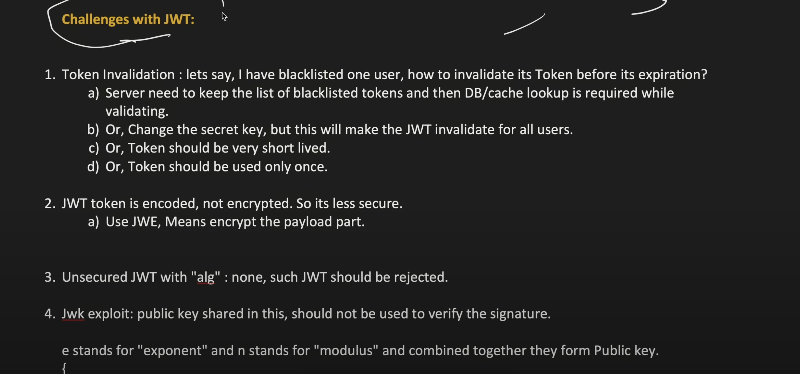
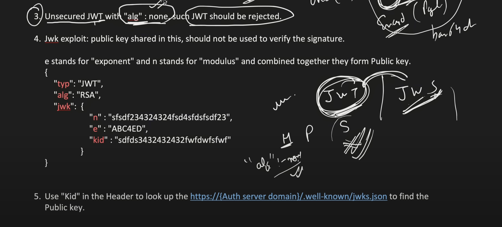
