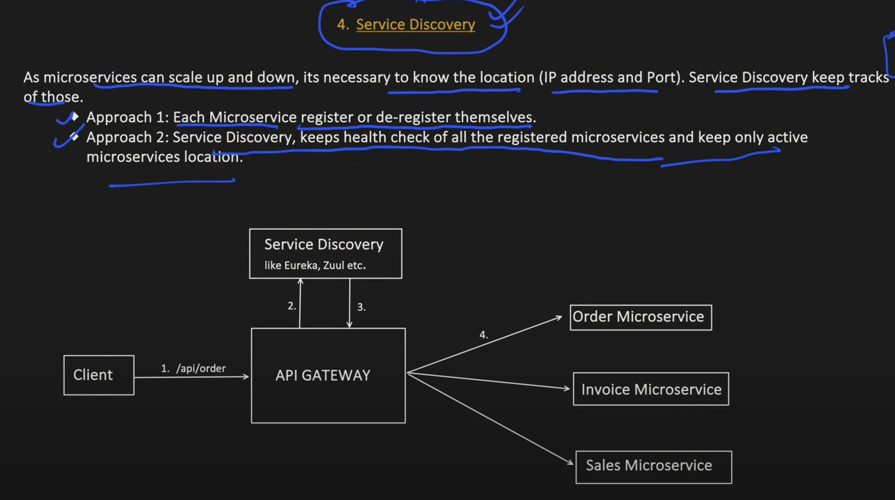

# API Gateway

- API Composition is highly used in Netflix

- In distributed Env, the services and load balancers keep on scale up/down, Service Discovery keeps the track of their IPs,

And many other capabilities like : 

- Request-Response transformation
- Response Caching
- Logging

If API Gateway is a single entry point, how does it handle millions of requests per second?
Region -> Mumbai
AZ -> Area (with dedicated data center)

