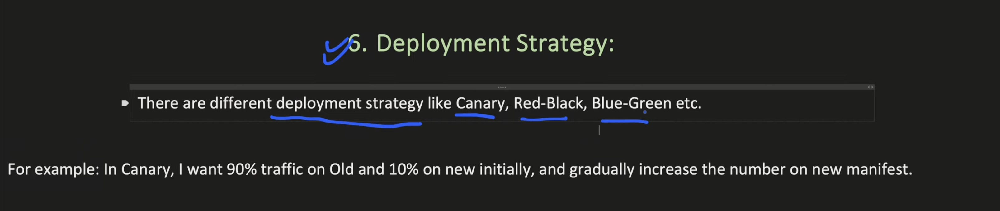

# Service Mesh

How 2 microservices communicate with each other? (Microservice1 and Microservice2 in the diagram)

### Service Discovery capability

The Sidecar Proxies have all the 7 capabilities - 
- LoadBalancers
- Service Disovery
- Authorizatio / Authentication
- Deployment Strategy
- Circuit Breaker
- Retry
- Telemetry

We can control SideCar proxy through control panel

// TODO

### Service Mesh Architecture Components

- Control Plane includes:
    - Configuration Manager (Galley in Istio): Validates YAML configurations and UI inputs
    - Traffic Controller (Pilot in Istio): Forwards validated configurations to sidecars
    - Security Manager (Citadel in Istio): Handles authentication and authorization
    - Telemetry: Collects metrics using pull method from sidecar proxies

### Sidecar Proxy Capabilities (Envoy in Istio)

- Load balancing functionality
- Retry mechanism
- Deployment strategy management
- Service discovery
- Request interception without direct network calls
- Communication encryption using TLS certificates

### Security Implementation

- Secure proxy-to-proxy communication through encryption
- TLS certificate management for authentication
- Public/private key infrastructure
- Identity verification for microservices
- Permission management for API access

### Communication Flow

- Microservices now only need application names instead of URLs/ports
- Sidecar proxy handles service discovery and load balancing
- Control plane updates happen only during configuration changes
- No real-time network calls between control plane and data plane
- Request flow: Microservice → Sidecar Proxy → Target Service’s Sidecar → Target Service