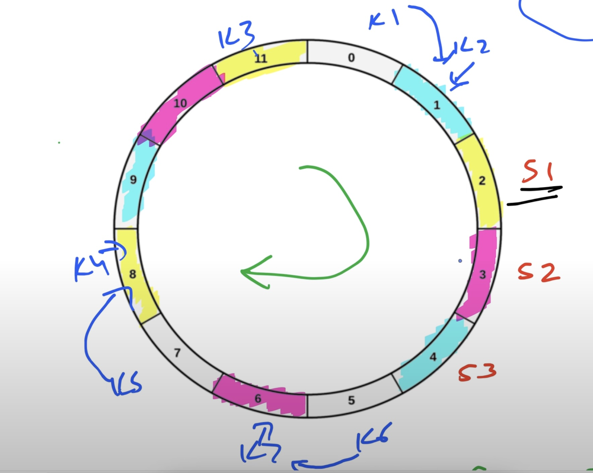

# Consistent Hashing

---
## Introduction

**Hashing** is a technique used to map data of arbitrary size to fixed-size values. In distributed systems, hashing helps in distributing load evenly across servers or shards.

### Basic Hashing

A key of arbitrary length is passed through a hash function to generate a fixed-length output. This output is then used with a modulo operation to assign the key to a position in a table or list of servers.

**Example:**
```
Key = "Shrayansh"
Hash("Shrayansh") = 20
20 % 6 = 2  → Stored at index 2 of the table
```

### Problem with Basic Mod Hashing

In scenarios like **load balancing** or **horizontal sharding**, we want to distribute data or traffic equally. Modulo hashing works well only if the number of nodes (servers) remains **constant**.

#### Issue with Changing Nodes

Suppose we have 3 nodes. The hash function distributes keys using `mod 3`.  
Now, if we add a new node (total 4 nodes), the distribution changes to `mod 4`.

The same key (`"Shrayansh"`) that was earlier stored in node 1 may now map to node 4. This results in **rebalancing** — redistributing many keys to different nodes.

In systems with **millions of keys**, this can be highly inefficient.

## Solution: Consistent Hashing

With **consistent hashing**, when a node is added or removed, **only a small portion of the keys (~1/n%)** need to be rebalanced.

### How It Works

Imagine a **virtual ring** or **circular queue** of fixed size (e.g., 12 slots).

- Servers are placed on the ring using their hash values modulo 12.
- Example with 3 servers:
    - S1 → `Hash(S1) % 12 = 3`
    - S2 → `Hash(S2) % 12 = 7`
    - S3 → `Hash(S3) % 12 = 11`

#### Mapping Keys to Servers

Keys are also hashed and placed on the ring.

**Example Key Hashes:**
```
Key1 = 1
Key2 = 2
Key3 = 9
Key4 = 10
Key5 = 6
Key6 = 8
Key7 = 4
```

**Assignment Logic:** Move clockwise from the key’s position to the next available server.

**Key Assignments:**
- S1 → K1, K2
- S2 → K5, K7
- S3 → K3, K4, K6


### Adding a New Server

If a new server **S4** is added at position 5:
- Only **K7** needs to be rebalanced to S4.


### Removing a Server

If **S2** at position 7 is removed:
- **K5** is reassigned to the next server (S3).


## Disadvantage of Consistent Hashing

If servers are placed **consecutively** (e.g., positions 2, 3, 4), one server may end up handling all the load.


### Solution: Virtual Nodes (Replicas)

Create **virtual replicas** of each server at different positions on the ring.

**Example:**
- S1 → Positions 2, 8, 11
- S2 → Positions 3, 6, 10
- S3 → Positions 1, 4, 9

This balances the key distribution more effectively.

**Final Key Assignment:**
- S1 → Key5, Key4, Key3
- S2 → Key6, Key7
- S3 → Key1, Key2



### How Many Replicas?

As many as needed to maintain rebalance to ~1/n% of total keys.

