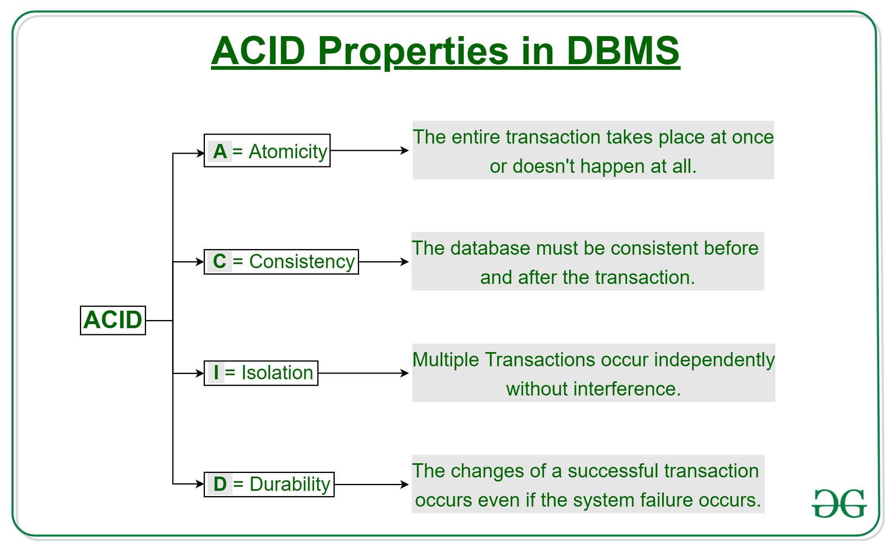

## Database
ACID Properties

ACID stands for Atomicity, Consistency, Isolation, and Durability.

A transaction in DBMS refers to a sequence of operations performed as a single unit of work. These operations may involve 
reading or writing data to the database. To maintain data integrity, DBMS ensures that each transaction adheres to the ACID properties

### How ACID Properties Impact DBMS Design and Operation
The ACID properties, in totality, provide a mechanism to ensure the correctness and consistency of a database in a way 
such that each transaction is a group of operations that acts as a single unit, produces consistent results, acts in 
isolation from other operations, and updates that it makes are durably stored.

1. Data Integrity and Consistency
   ACID properties safeguard the data integrity of a DBMS by ensuring that transactions either complete successfully or leave no trace if interrupted. They prevent partial updates from corrupting the data and ensure that the database transitions only between valid states.

2. Concurrency Control
   ACID properties provide a solid framework for managing concurrent transactions. Isolation ensures that transactions do not interfere with each other, preventing data anomalies such as lost updates, temporary inconsistency, and uncommitted data.

3. Recovery and Fault Tolerance
   Durability ensures that even if a system crashes, the database can recover to a consistent state. Thanks to the Atomicity and Durability properties, if a transaction fails midway, the database remains in a consistent state.

| **Property**    | **Maintained By**           |
| --------------- | --------------------------- |
| **Atomicity**   | Transaction Manager         |
| **Consistency** | Application Programmer      |
| **Isolation**   | Concurrency Control Manager |
| **Durability**  | Recovery System             |

### Advantages of ACID Properties in DBMS

Data Consistency: ACID properties ensure that the data remains consistent and accurate after any transaction execution.

Data Integrity: It maintains the integrity of the data by ensuring that any changes to the database are permanent and cannot be lost.

Concurrency Control: ACID properties help to manage multiple transactions occurring concurrently by preventing interference between them.
Recovery: ACID properties ensure that in case of any failure or crash, the system can recover the data up to the point of failure or crash.

### Disadvantages of ACID Properties in DBMS

Performance Overhead: ACID properties can introduce performance costs, especially when enforcing isolation between transactions or ensuring atomicity.

Complexity: Maintaining ACID properties in distributed systems (like microservices or cloud environments) can be complex and may require sophisticated solutions like distributed locking or transaction coordination.

Scalability Issues: ACID properties can pose scalability challenges, particularly in systems with high transaction volumes, where traditional relational databases may struggle under load.

----

### Data Replication

