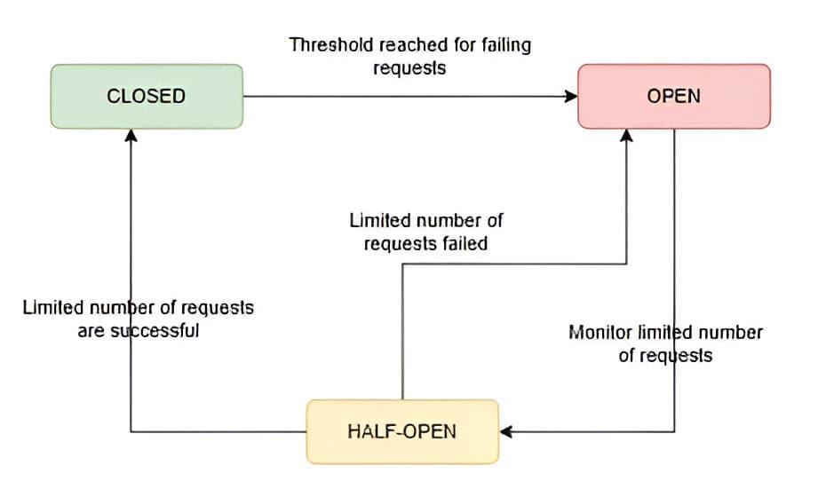

# Circuit breaker pattern

In microservices architecture, a circuit breaker is a design pattern used to handle faults that may occur when calling remote services. The purpose of the circuit breaker is to prevent a cascade of failures in a distributed system by providing a fallback mechanism when a service is unavailable or experiencing issues.

A circuit breaker monitors the calls to a remote service. If the number of failures exceeds a predefined threshold within a specified time period, the circuit breaker “opens,” meaning subsequent calls to the remote service are automatically redirected to a fallback mechanism, such as returning a cached response or providing a default value. This prevents additional load on the failing service and allows it to recover without causing further disruption to the system.

Here’s how the circuit breaker pattern typically works in microservices architecture:

1. Closed State:
   Initially, the circuit breaker is in a “closed” state, allowing calls to the remote service to proceed as normal.
   During this state, the circuit breaker monitors the calls to the remote service. If the call succeeds, it resets the failure count. If the call fails, it increments the failure count.
2. Open State:
   If the number of failures within a specified time window exceeds a predefined threshold, the circuit breaker transitions to an “open” state.
   In the open state, subsequent calls to the remote service are intercepted, and the circuit breaker immediately returns a predefined fallback response without attempting to call the remote service.
   This prevents additional calls from overwhelming the failing service and allows it time to recover.
3. Half-Open State:
   After a certain period of time, the circuit breaker enters a “half-open” state, where it allows a limited number of calls to the remote service to test if it has recovered.
   If these test calls succeed, the circuit breaker transitions back to the closed state, allowing normal operation to resume.
   If the test calls continue to fail, the circuit breaker remains in the open state, and the process repeats.
   By using the circuit breaker pattern, microservices can gracefully handle failures in distributed systems, improve fault tolerance, and prevent cascading failures. Implementing circuit breakers requires careful configuration of thresholds, timeouts, and fallback mechanisms to ensure optimal performance and resilience in the face of failures. There are also libraries and frameworks available in various programming languages that provide implementations of the circuit breaker pattern, simplifying its integration into microservices architectures.

----

