# SOLID


## SINGLE RESPONSIBILITY Principle
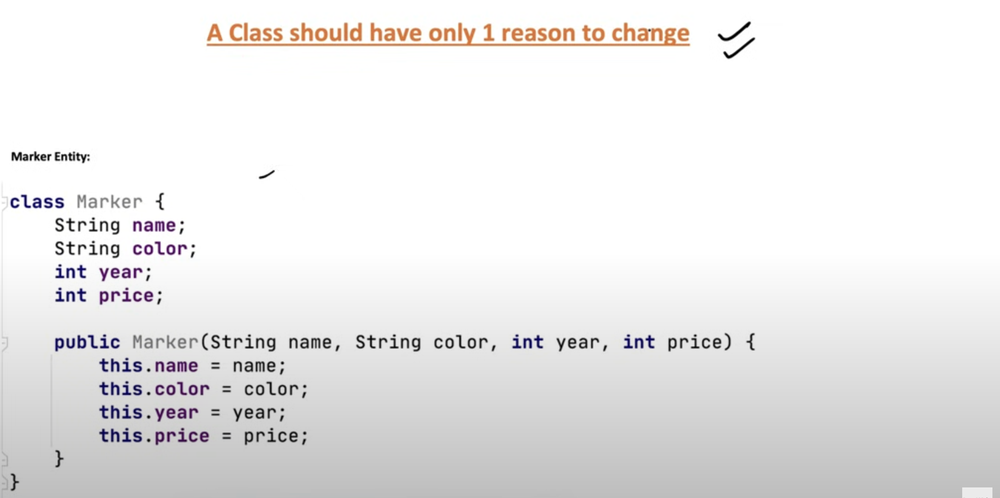
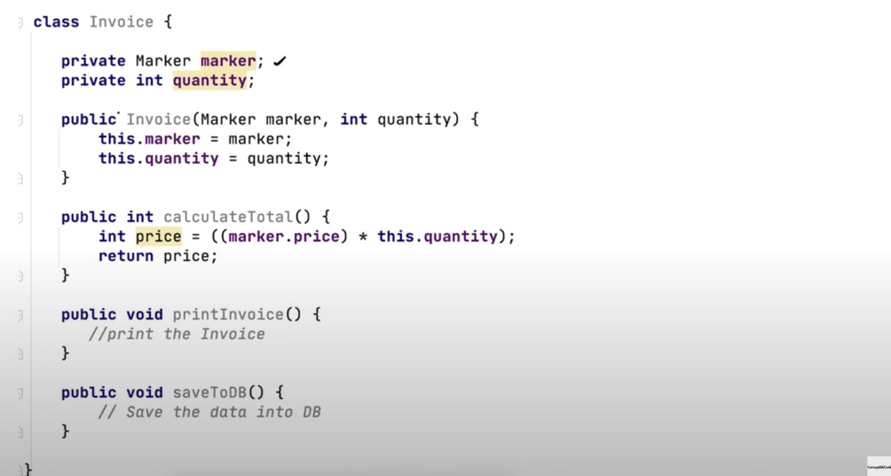

Invoice **"has a"** Marker

- There are multiple changes that can occur in same class, let's assume
changes in calculation logic, changes in printing logic, adding a feature to save to file as well along with DB.

So, now let's break down this as - 


- This is just having calculation logic

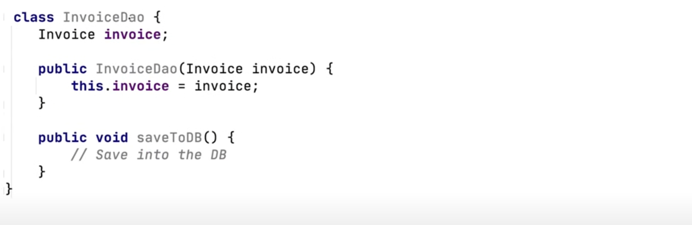

- A separate class for saving to DB


- Another one to print the Invoice

------
## OPEN / CLOSED Principle

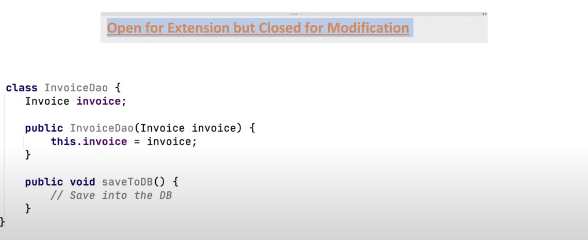


- To add a new functionality of "save to file", we wrote some code directly in DAO
But this is not the right way

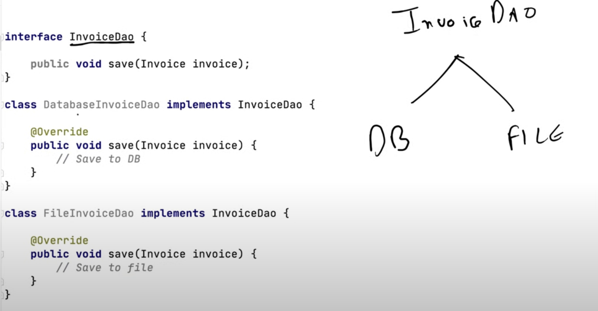

-----

## LISKOV Substitution

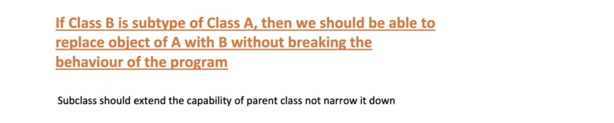

```
interface Bike {
    void turnOnEngine();
    void accelerate();
}

class MotorCycle implements Bike {

    boolean isEngineOn;
    int speed;
    
    public void turnOnEngine() {
        // turn on the engine!
        isEngineOn = true;
    }
    
    public void accelerate() {
        // increase the speed
        speed = speed + 10; 
    }
}

class Bicycle implements Bike {

    public void turnOnEngine() {
        throw new AssertionError ("there is no engine");
    }
    public void accelerate () {
        //do something
    }
}

}

```

Here, the functionality is narrowed down, the Bike's functionality "turn on the engine" doesn't exist in Bicycle

-----

## INTERFACE SEGMENTED Principle


The interface RestaurantEmployee has many functionalities like

- washDishes
- serverCustomers
- cookFood

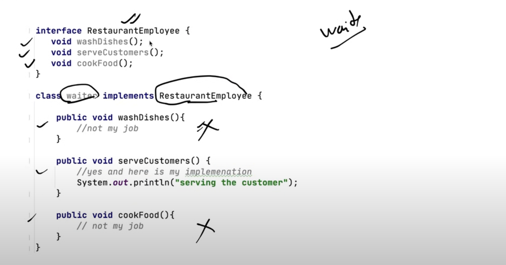

The waiter class has to unnecessary implement all these methods.\
Waiter only has "serveCustomers" functionality.

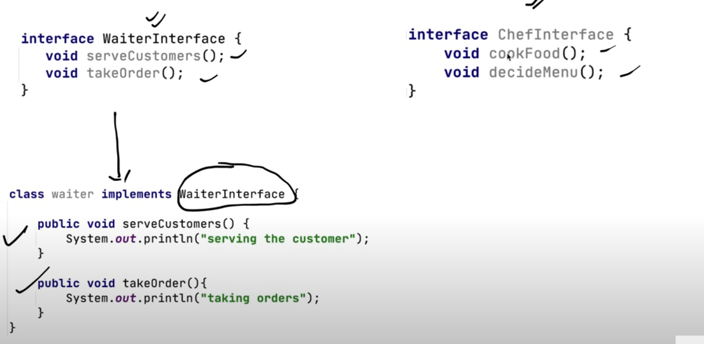

--------

## DEPENDENCY INVERSION


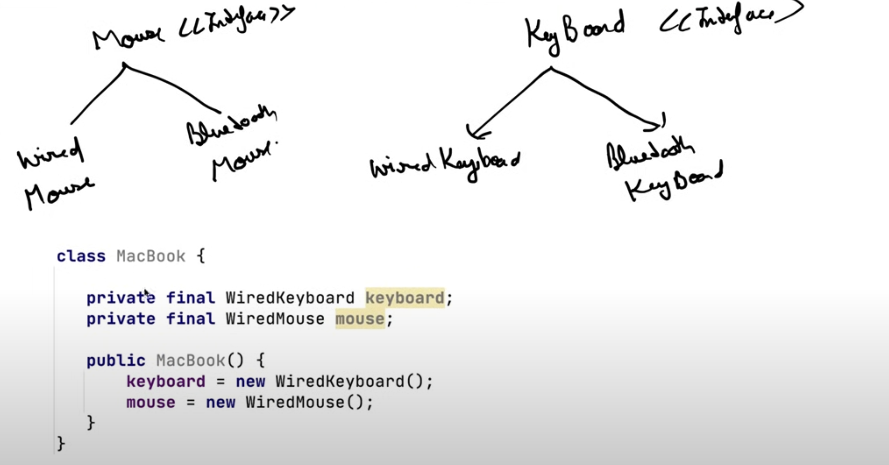

We have concrete class objects here, which is violating Dependency Inversion principle,

So instead we should take interfaces "Mouse" and "Keyboard"


we can pass WiredKeyboard or BluetoothKeyboard in constructor now


----


----

## 1.1 Liskov Principle 

If you substitute the Child or Parent Object, the program should not break

e.g. 

```

Parent parentObj = new Child1();

Parent parentObj = new Child2();
Parent parentObj = new Child3();
.
.
.
```

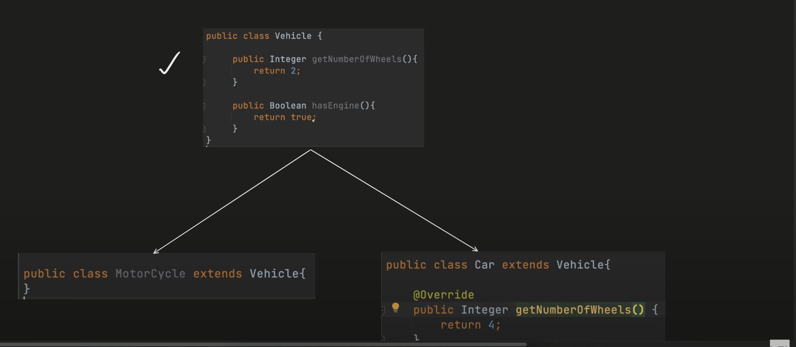
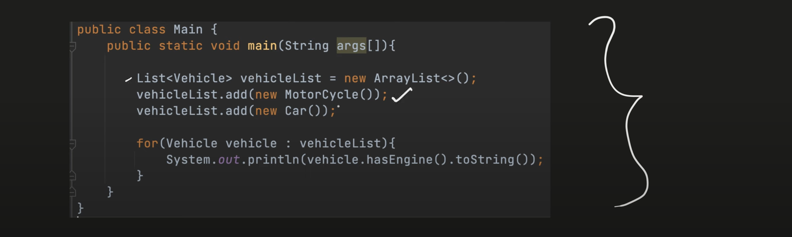

Here the Output will be `true` for both the prints

Now what is the problem here - 

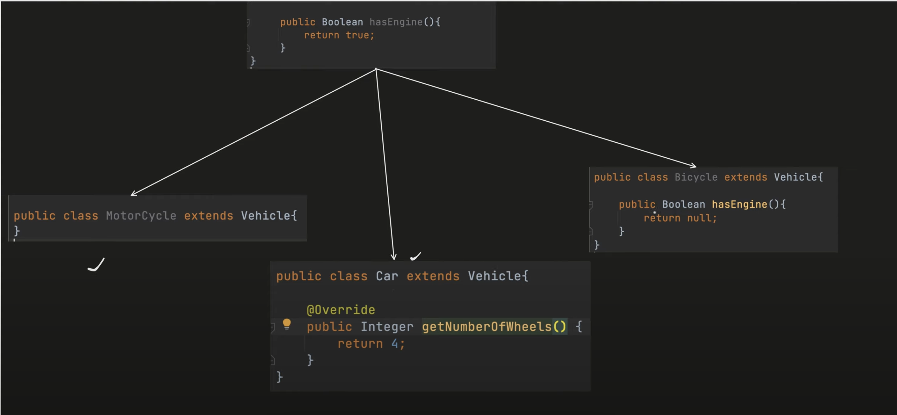

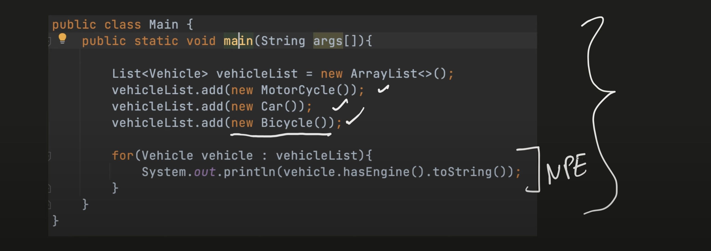

This will throw NullPointerException, which shows that the child has narrowed down the functionality of parent

So in parent, put only generic method which are common for all


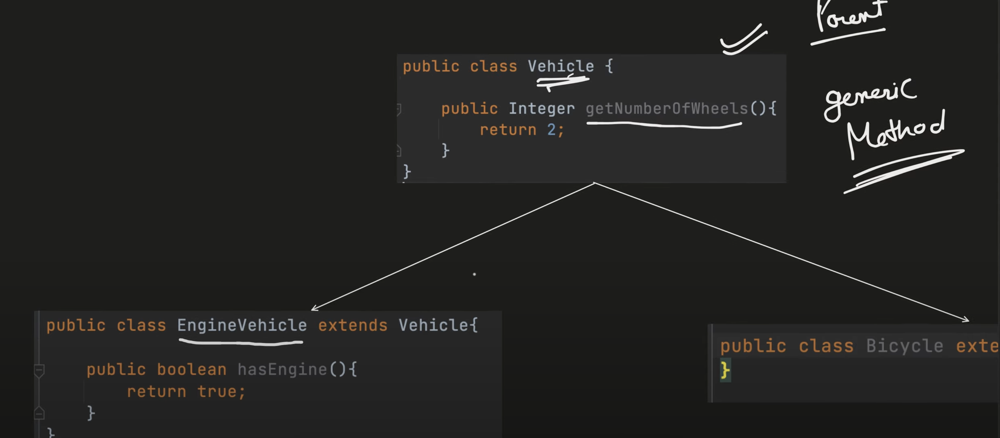
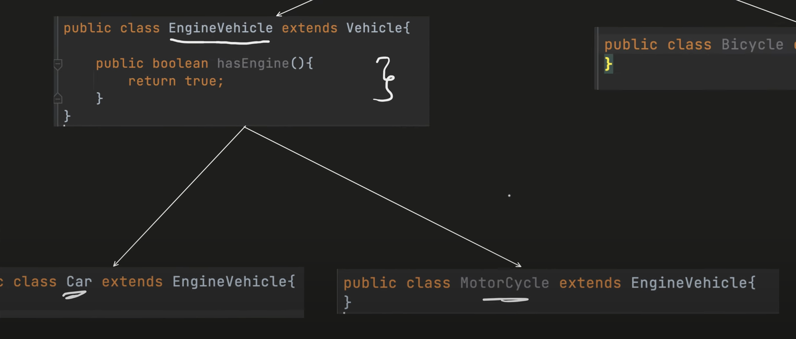
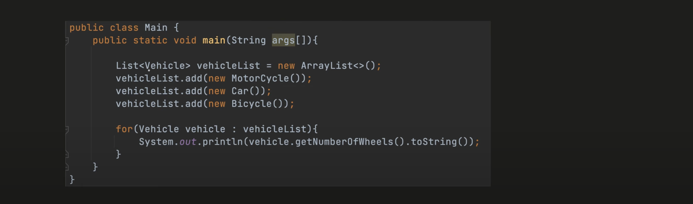
- WithoutStrategyPattern.Vehicle only have the getNumberOfWheels now


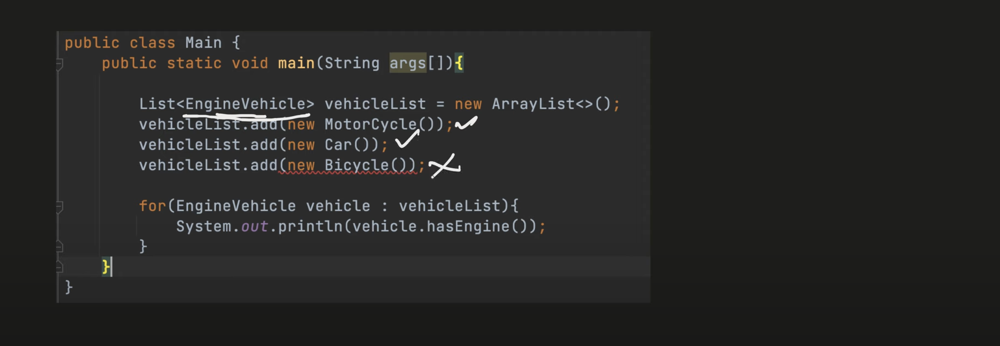

- Bicycle gives error as the EngineVehicle is being referenced by Motorcycle and Car only.

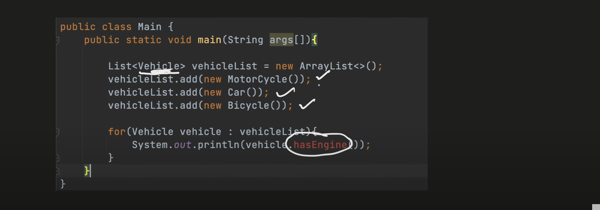

Similarly the Vehice dont have "hasEngine"
