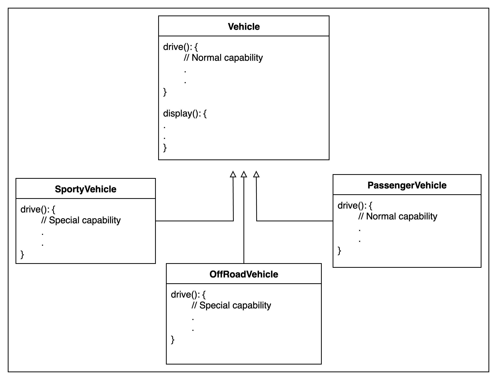
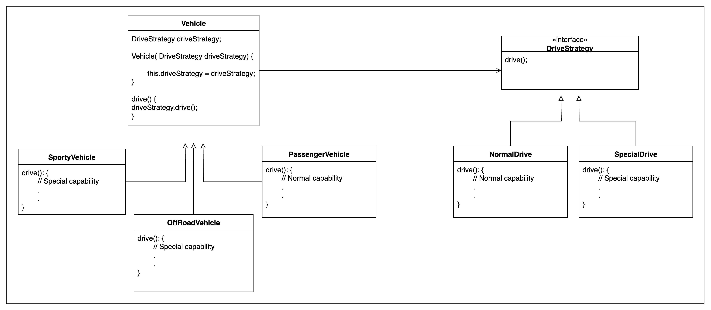

# Strategy Pattern

If multiple children have same type of capabilities, this means that the code is not reusable, 
In scalable , growing functionality code, chances are high that more children are created and those can have 
same capabilities,\
Here, Base class has bad code, which leads us to this scenario where child can not use Parent's capability 

Here the "Special Drive capability" is being used in 2 or more difference type of vehicles which is code duplication

