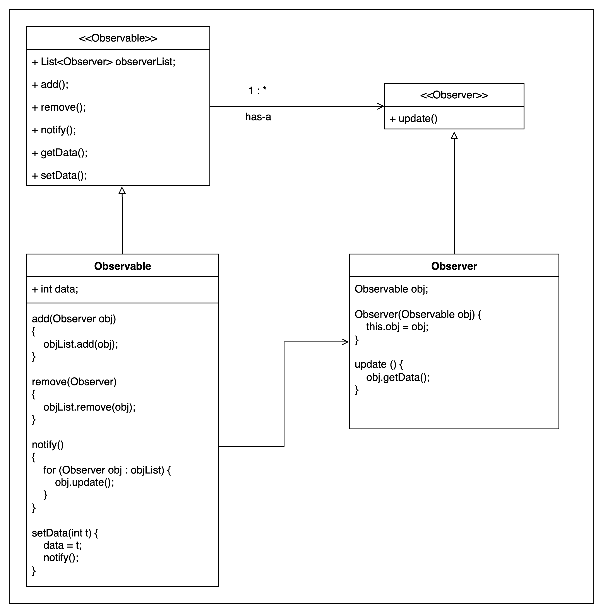

# Observer Pattern

Implement Amazon's notify me for any out of stock Product

We have 2 entities
1. Observable
2. Observer

there can be multiple observable 
whenever the state is changed of observable, it updates the Observer about its state change

```java

Observable Interface

List<ImageObserver> observers;

add(Observer obj)

remove(Observer obj)

notify()

setdata()
```

> Relationship is "has-a" with One to Many


```java
Observer Interface

update ()
```

```java

Observable Concrete class

    int data;
    
add(Observer obj)
{
    objList.add(obj);
}

remove(Observer)
{
    objList.remove(obj);
}

notify() 
{
    for (Observer obj : objList) {
        obj.update();
    }
}

setData(int t) {
    data = t;
    notify();
}
```

> Observable concrete class has a "is-a" relationship with Observable interface


```java
Observer Concrete class

Observable obj;
    
Observer(Observable obj) {
    this.obj = obj;
}


update () {
    obj.getData();
}
```

Key points :
- Keep the update() method in Observable Concrete class with 0 args and associate the Observer concrete class
with Observable Concrete class with "has-a" relationship.
- Which means when we will create the constructor of Observer Concrete class, we will pass the object of Observable Concrete class's object
- So whenever the update method will be called, the observable pbj is already being passed by constructor injection ( what we do in strategy pattern)
- Why do we do this? to avoid multiple "instance of" checks for different observable concrete classes,
Basically, we can remove the has a realtion between the concrete classes, and can direct pass the object of observable concrete class to update() method as argument, 
then inside the Observer Concrete class, we can access the observabl econcrete class tp update or perform whatever is desired



---

### Example

Weather Station, checks the current temperature in every 5 minutes, -> Obervable
Tv Display, Mobile Display -> Observers
