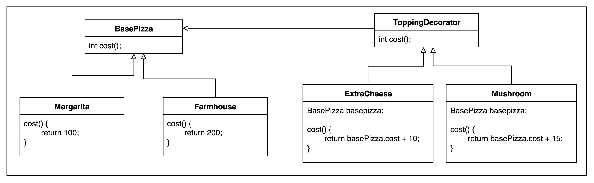

# Decorator Pattern

Adding the features on the top of existing feature
Basically we wraps the feature with additional feature

### Use cases : 
- Pizza Shop : 
We can add multiple / different toppings on the base pizza
Base Pizza, decorated with extra cheese, mushroom , etc/. 

- Coffee 
Decaf / espresso as base coffee
Extra milk, double cream, etc. can be added over the base coffee

- Car
Base Car + fog lamps, stereo , etc.

  

Why we need Decorator Pattern?

Class Explosion : There can be N number of permutations and combinations,
there will be a lot of classes possible
so we have a base class fixed and we just add on different toppings on the base.

In the example code of Pizza
The topping decorator itself will be a decorated object and also it can be "has-a",
so topping decorator can be is-a and has-a both 