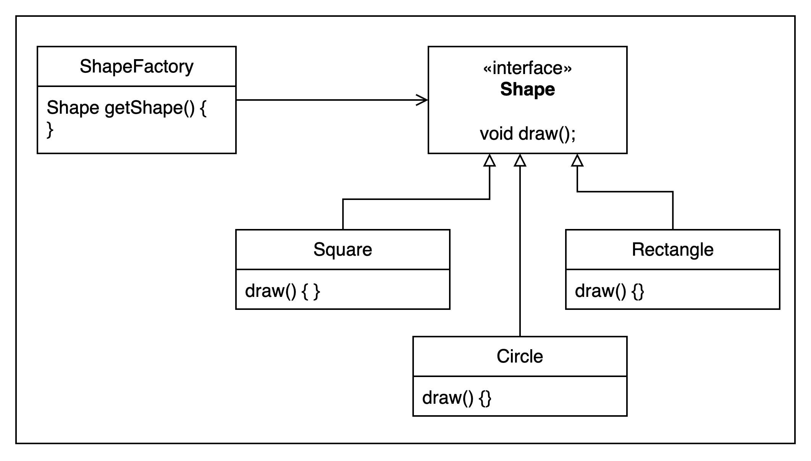
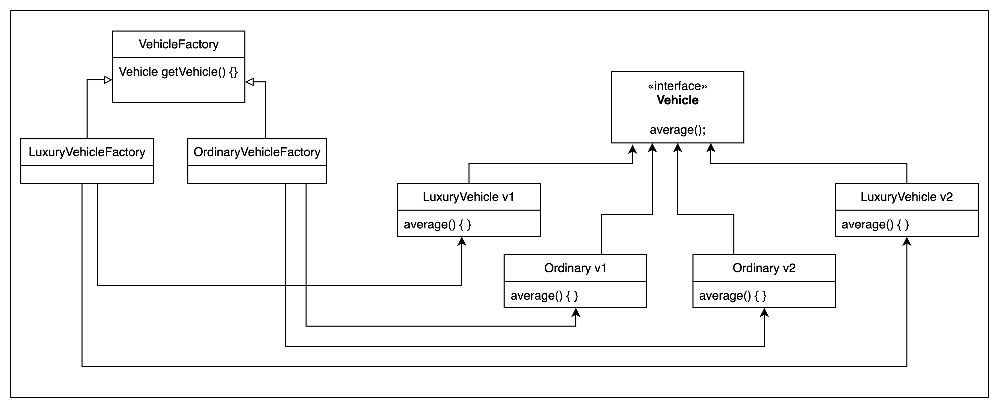

# Factory Pattern

It is creational pattern, which means\
whenever we need to create an object on the basis of some condition, we use Factory Pattern

---

# Abstract Factory Pattern

Its a factory of factories,
When we can group together, different kinds of products
example we can create a factory of luxury vehicle and another one for ordinary vehicle, and already we have a factory of vehicle

