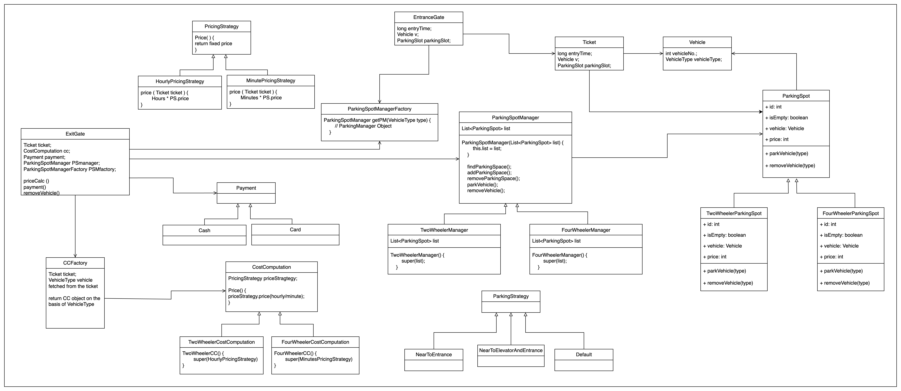

# Design Parking Lot

### 1. Rough Flow - Prepare the rough flow 
- **Requirement Clarification**
- **Objects** 

```markdown
Vehicle [Entry Gate] --> [Parking Spot]   --> [Exit]  -->  Vehicle Out   
(Ticket)                                     (Payment)
```

### Requirement - 

#### First -
- How many Entrances ?\
in our area, how many entrances? 
For now keep 1 IN and 1 Out but code should be scalable to add more entry exits in future

#### Second -

- Also regarding the parking spot \
What are different Types of Spot -
  - 2 wheeler
  - 4 wheeler

again it should be extensible for further modification ( 3 wheeler , or for truck ,etc. )


#### Third -
- Hourly Based Charge / Minute Based Charge? Or mix?
---
### Objects

How many Objects ? 

- **Vehicle**
- **Ticket**
- **Entrance Gate**
- **Parking Spot**


#### Vehicle - 
- Vehicle number
- Vehicle Type 

```java
enum VehicleType { 
    TWO_WHEELER,
    FOUR_WHEELER
}
```

#### Ticket - 
- Entry Time
- Parking spot ( which also includes the price whihc may vary for 2 and 4 wheeler)

#### Entrance Gate -
- find the parking space, 
- update the parking space 
- generate ticket
- there can be a requirement that the parking space allotted should be nearest to entrance
- for simplicity we will not consider multiple floors.

#### Parking Spot -
- Id, 
- isEmpty, 
- Vheilce, 
- Price, 
- type ( 2 / 4 wheeler)

#### Exit gate - 
- Cost collection
- Payment
- update parking spot

---

### Design 

2 Approaches 

1. Top Down ( start with entrance gate and continue with further requirements )
2. Bottom UP ( Start with the spot and identify what are the needs and design parents , etc. )


```java
class ParkingSpot {
    int id;
    boolean isEmpty;
    Vehicle vehicle;
    int price;
    
    void parkVehicle (Vehicle v) 
    {
        vehicle = v;
        isEmpty = false;
    }

    void RemoveVehicle ()
    {
        vehicle = null;
        isEmpty = true;
    }
}
```

```java
class TwoWheelerSpot{
    price() { 10;} 
}
```

```java
class FourWheelerSpot {
    price() { 20;}
}
```
Similarly we can extend more for Heavy Utily Vehicle ( trucks, etc. )

> TwoWheeler Spot and FourWheeler Spot "is-a" ParkingSpot so inheritance

```java
class ParkingSpotManager {

    List<ParkingSpot> list;

    ParkingSpotManager(List<ParkingSpot> list) {
        this.list = list;
    }

    findParkingSpace();

    addParkingSpace();
    
    removeParkingSpace();

    parkVehicle();

    removeVehicle();

}

```

> ParkinSpotManager posses "has-a" relationship with ParkingSpot

```java
class TwoWheelerManager extends ParkingSpotManager {
    List<ParkingSpot> list = {
// 500 total spaces
    };

    TwoWheelerManager() {
        super(list);
    }
}

```

```java
class FourWheelerManager extends ParkingSpotManager {
    List<ParkingSpot> list = {
// 400 total spaces
    };

    FourWheelerManager() {
        super(list);
    }
}
```
> TwoWheeler and FourWheeler managers are created because we may have dedicated specific number of parking spaces available for both

These 2 will return their list to parent


> We have done **Object > Parking Spot**

---
Let's discuss 
**Requirement > Parking Near Entrance**


We can create ParkingStrategy
- Near to Entrance
- Near to Entrance and Elevator
- Default


So now, let's modify the existing managers in such a way that

- Assume, the TwoWheeler has `NearToEntrance` strategy and Four Wheeler has `NearToEntranceAndElevator`

```java
class TwoWheelerManager extends ParkingSpotManager {
    ParkingStrategy strategy = new NearToEntranceStrategy();
    List<ParkingSpot> list = {
// 500 total spaces
    };

    TwoWheelerManager() {
        super(list, strategy);
    }
}
```

```java
class FourWheelerManager extends ParkingSpotManager {
    ParkingStrategy strategy = new NearToEntranceAndElevatorStrategy();
    List<ParkingSpot> list = {
// 400 total spaces
    };

    FourWheelerManager() {
        super(list, strategy);
    }
}
```


and then the ParkingStrategies can call findParkingSpace() and pass on their strategy

> We have done **Requirement > Parking Spot should be nearest to Entrance**

---

```java
class Vehicle {
    int vehicleNumber;
    VehicleType vehicleType;
}
```

> ParkingSpot has-a vehicle

> **Object > Vehicle** Covered

---
```java
class Ticket {
    long entryTime;
    Vehicle v;
    ParkingSlot parkingSlot;
    // getters and setters;
}
```

> Ticket has a ParkingSpot

> **Object > Ticket** done
---

**Entrance Gate**

It has to find the parking space, and for that it needs to decide which Parkingmanager to call ( 2 or 4 wheeler)

So here we need to implement another pattern which is "Factory"

```java
class ParkingSpotManagerFactory {
    ParkingSpotManager getParkingManager(VehicleType type) {
        // ParkingManager Object is returned on the basis of vehicle type
    }
}
```

> ParkingSpotManagerFactory "has-a" ParkingSpotManager and also the EntranceGate "has-a" Factory

Now coming back to EntranceGate

```java


class EntranceGate {
    ParkingSpotManagerFactory factory;
    ParkingSpotManager parkingSpotManager; // Assume the 2wheeler object is being sent by manager
    Ticket ticket;

    findParkingSpaceManager(VehicleType type, EntranceGateNo entranceGateNo) // Also the second argument can be EntranceGate number in case of multiple gates

    bookSpot(Vehicle v) // this will call the parkvehicle of Vehicle Manager to book the spot

    generateTicket(Vehicle v, ParkingSpot parkingSpot)
}
```
Since we need to find the space on the basis of vehicle type,
we have ParkingSpotManager already, we will call "findSpace()" on parkingSpotManager by passing vehicletype
Assume twowheeler is the vehicle type, so now the strategy and list will be sent 

> Also EntranceGate has-a Ticker

> **Object > EntranceGate** along with **Requirement > How may Entrances** is done

---
Now let's cover Hourly based Charge and Exit Gate


lets take a CostComputation class 


Pricing Strategy
Price() { 
    return PS.price;
    // assume fixed Price 

}

- Ticket already has ParkingSpot
- Calculate hours * ParkingSlot price
HourlyPricingStrategy

Price (Ticket) {
 return hours * PS.price;
}

MinutePricingStrategy
Price(Ticket) {
    return minutes * PS.price;
}


CostComputation
pricingStrategy obj;
Price() {
    obj.price(hourly)
}

2WheelerCost

2wheelercostcomputation() {
    super(HourlyPS)
}


4WheelerCost

4wheelercostcomputation() {
super(Minute)
}

finally

for ExitGate

we also have CostComputationFactory;

CCFactory
ticket // which already have vehicle in it
{
VeicleType basis return 2 or 4 wheeler
}


ExitGate
Ticket
CostComputation obj;
Payment p
PSmanger

PriceCal()
Payment()
// we can have differnet payment modes similar to how we designed the strategy for others we can have same for payment, cash card ,etc can be different strategies
removeVehicle();


in exit gate, we also need parkingspot manager

