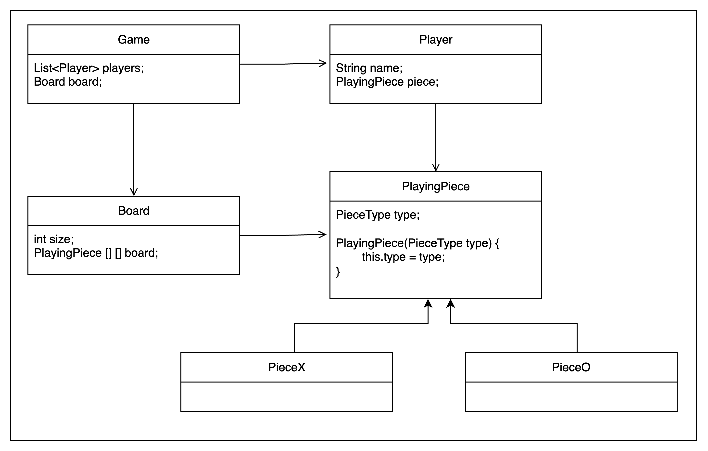

# TicTacToe

Objects 

- Piece : X and O (or also we can add more symbols to extend the functoinality)
- Board : n * n (generally 3 by 3 but again for extensible functionality we will keep n)
- Players


```java
enum PieceType {
    X,
    O
        }
```

```java
class PlayingPiece {
    PieceType type;
    
    PlayingPiece(PieceType type) {
        this.type = type;
    }
}

class Piece_X {
}

class Piece_O {
}

```
PlayingPiece will assign Piece dynamically with the help of its children (Piece_X, Piece_O)
So the constructors of PieceX and PieceO will pass X or O to its super();

```java

class Board {
    int size;
    PlayingPiece[][] board;
}
```

> Board "has-a" Playing piece

```java
class Player {
    String name;
    PlayingPiece piece
}
```

> Player also "has-a" piece


```java
class Game {
    List<Players> players;
    Board board;
}
```

> Game "has-a" Players and "has-a" Board

